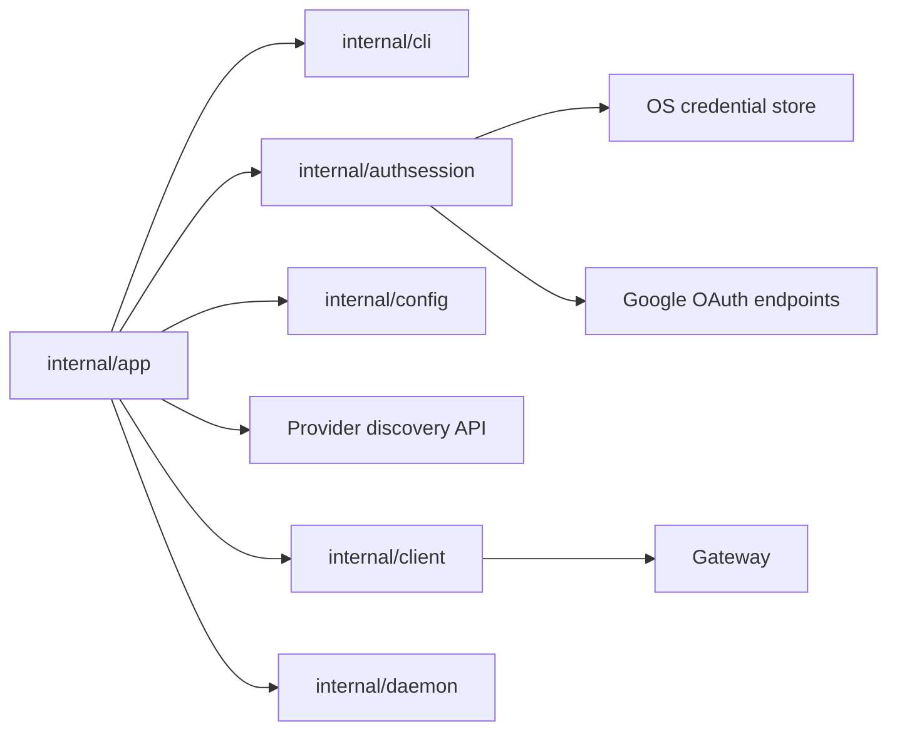

# Компонентная структура CLI Auth

Этот документ определяет internal component structure для service-discovered
provider auth и универсального OIDC adapter, первоначально используемого Google.

Он следует:

- CLI guide: [`../user-guides/sqlrs-auth.md`](../user-guides/sqlrs-auth.md)
- Interaction flow: [`cli-auth-flow.RU.md`](cli-auth-flow.RU.md)
- ADR:
  [`../adr/2026-09-24-remote-connection-bootstrap.md`](../adr/2026-09-24-remote-connection-bootstrap.md)

## 1. Scope и предпосылки

- Срез покрывает:
  - `sqlrs auth login <provider>`
  - `sqlrs auth status`
  - `sqlrs auth logout`
  - effective bearer-token resolution для protected remote API commands.
- Первый adapter — универсальный OIDC; первый настроенный provider — Google.
- OIDC adapter поддерживает public native clients с Authorization Code,
  PKCE S256, loopback redirect, ID и refresh tokens и token endpoint
  authentication method `none`. Он также требует RFC 9207
  authorization-response issuer identification.
- Выбранный remote profile должен использовать `auth.mode: remoteSession` для
  service-discovered sessions.
- `SQLRS_TOKEN` остается самым приоритетным override и bypass-ит stored
  sessions.
- Gateway принимает только short-lived Google ID token-ы. Refresh token-ы
  остаются client-only.

## 2. Deployment units

### CLI (`frontend/cli-go`)

CLI владеет login orchestration, local session storage, token refresh, command
rendering и protected-command bearer-token resolution.

| Module | Responsibility |
| --- | --- |
| `internal/app` | Dispatch `auth` commands; резолвить profile/mode/output; получать выбранную provider configuration; вызывать auth session manager; reconcile-ить один organization endpoint; разрешать effective bearer token до protected commands. |
| `internal/cli` | Определять auth command option/result types и human/JSON renderers. Не допускать token-bearing values в rendered output. |
| `internal/authsession` | Владеть provider-adapter dispatch, PKCE, генерацией state/nonce, сборкой auth URL из advertised endpoints, login-attempt issuer/redirect binding, validation loopback callback, token exchange/refresh/revoke, decoding claims, credential-store access и effective bearer-token selection. |
| `internal/config` | Загружать stable installation/routing metadata, `auth.mode`, `auth.tokenEnv` и legacy `auth.token`. Никогда не хранит provider client configuration, refresh token-ы или raw ID token-ы. |
| `internal/client` | Владеть connection-info/provider discovery и sqlrs `/v1/*` API calls. Protected API methods получают уже resolved bearer token. |
| `internal/paths` | Предоставляет OS-specific config/state paths, когда auth session manager нужны stable application names или diagnostic context. |

Предлагаемый package/file layout:

```text
frontend/cli-go/internal/authsession/
  manager.go
  pkce.go
  claims.go
  oidc.go
  loopback.go
  store.go
  store_windows.go
  store_darwin.go
  store_linux.go
```

Auth session code остается вне `internal/client`, чтобы sqlrs API client не
становился одновременно Google OAuth client. Он остается вне `internal/config`,
чтобы config loading не становился session storage.

### Local engine (`backend/local-engine-go`)

Компоненты local engine не добавляются и не меняются.

Local engine продолжает принимать существующий local bearer token из
`engine.json` для protected local endpoints. Он никогда не видит Google refresh
token-ы и не участвует в командах `sqlrs auth`.

### Shared services и gateway

Gateway добавляет public connection-info, provider collection и provider detail
routes на installation base и под любым candidate organization prefix. Эти
routes не проверяют и не раскрывают существование организации. Protected
requests проверяют candidate prefix и возвращают `404` по своим существующим
disclosure rules.

Service рекламирует provider только тогда, когда gateway trust configuration
принимает точные issuer и client ID этого provider как audience. Startup
проверяет этот invariant; при несогласованной provider/gateway configuration
bootstrap и provider routes возвращают `503`. Поэтому включение нового provider
требует одновременно поддерживаемого CLI adapter profile и gateway trust.
Gateway отображает каждую trusted issuer/client-ID pair обратно в advertised
provider ID; external identity keys используют этот ID, а не adapter name
`oidc`.

Gateway не должен принимать, хранить или refresh-ить Google refresh token-ы.

## 3. Remote profile configuration

Provider client configuration удаляется из workspace ownership:

```go
type AuthConfig struct {
    Mode     string `yaml:"mode"`
    TokenEnv string `yaml:"tokenEnv"`
    Token    string `yaml:"token"`
}
```

Rules:

- `mode: fileToken` остается local-daemon auth.
- `mode: bearer` остается legacy explicit bearer-token path.
- `mode: remoteSession` включает active provider-session lookup и refresh.
- `tokenEnv` defaults to `SQLRS_TOKEN` для `remoteSession` profiles, когда
  omitted.
- `ProfileConfig` владеет `installationID`, `installationEndpoint`, mutable
  request `endpoint` и optional authenticated organization metadata. Полученный
  через public discovery path-prefixed endpoint остается unverified candidate.
- Provider ID, issuer, client ID, endpoints, scopes и adapter config version
  приходят из provider API и сохраняются только в session metadata по необходимости.

## 4. Ключевые типы и interfaces

### Bootstrap и provider configuration

`internal/client` decode-ит wire DTOs и проверяет все cross-field invariants до
того, как `internal/app` запишет config или вызовет auth adapter:

```go
type ConnectionInfo struct {
    InstallationID string
    Endpoints      ConnectionEndpoints
    AuthProviders  []AuthProviderSummary
}

type ConnectionEndpoints struct {
    Control string
    Current string
}

type AuthProviderSummary struct {
    ID          string
    DisplayName string
    Adapter     string
}

type OIDCProviderConfig struct {
    ID                                  string
    DisplayName                         string
    Adapter                             string // "oidc"
    ConfigurationVersion                int    // 1
    Flow                                string // "authorizationCodePKCE"
    Issuer                              string
    ClientID                            string
    AuthorizationEndpoint               string
    TokenEndpoint                       string
    TokenEndpointAuthMethod             string // "none"
    AuthorizationResponseISSSupported    bool   // true
    RevocationEndpoint                  string
    Scopes                              []string
    AuthorizationParameters             map[string]string
}
```

Validation требует unique provider IDs, `openid` в scopes и exact ID agreement
между request path и detail response. Login получает detail напрямую из
`<current>/v1/auth/providers/<provider>`; collection предназначен для discovery
и UI, но не является prerequisite login. Пустой provider list является
ошибкой normal remote-session init.

Service bases используют HTTPS, кроме явно разрешенного development HTTP на
literal loopback `127.0.0.1` или `[::1]`. Candidate base — installation root
или ровно один path segment с organization-slug grammar. Userinfo, query,
fragment, dot segments, encoded slash/backslash и trailing slash после
normalization запрещены. OIDC URLs используют HTTPS без userinfo или fragment.
Существующие query parameters OIDC endpoint разрешены, только если они не
конфликтуют с OAuth parameters, которыми владеет CLI. URL validation и joining
выполняются структурно, а не string-prefix comparison; bootstrap redirect не
может менять origin или делать downgrade. Absolute service URLs строятся из
trusted deployment configuration, а не из непроверенного HTTP `Host` или
forwarding header.

### Auth session manager

`authsession.Manager` - основной package service.

```go
type Manager struct {
    Store CredentialStore
    HTTP  OAuthHTTPClient
    Clock Clock
    Rand  io.Reader
    OpenBrowser BrowserOpener
}
```

Required operations:

- `Login(ctx, ProviderConfig, LoginOptions) (LoginResult, error)`
- `Status(ctx, StatusOptions) (StatusResult, error)`
- `Logout(ctx, LogoutOptions) (LogoutResult, error)`
- `ResolveBearerToken(ctx, ResolveOptions) (ResolvedBearerToken, error)`

### Credential store abstraction

```go
type CredentialStore interface {
    Get(ctx context.Context, key CredentialKey) (Session, bool, error)
    Put(ctx context.Context, key CredentialKey, session Session) error
    Delete(ctx context.Context, key CredentialKey) error
    GetLegacy(ctx context.Context, key LegacyCredentialKey) (Session, bool, error)
    DeleteLegacy(ctx context.Context, key LegacyCredentialKey) error
}
```

Platform implementations:

- Windows: Windows Credential Manager.
- macOS: Keychain.
- Linux: Secret Service/libsecret.

Недоступность Linux credential store возвращает понятную setup error. Plaintext
fallback для refresh token отсутствует.

### Credential key и session

Active session lookup scoped только к одному remote profile и stable
installation, поэтому session можно найти после restart без provider data в
workspace config:

```go
type CredentialKey struct {
    ProfileName          string
    InstallationID       string
    InstallationEndpoint string
}

type LegacyCredentialKey struct {
    ProfileName string
    Endpoint    string
    Provider    string
    Issuer      string
    ClientID    string
}
```

`InstallationEndpoint` — normalized control base; он не позволяет unrelated
origin заявить тот же server-supplied installation ID и получить cached token.
Session value владеет provider, issuer, client ID и subject. Успешный login
атомарно заменяет единственную active session для key, в том числе при смене
provider или account. Для будущей поддержки нескольких inactive sessions
потребуется отдельный persisted active-session reference.

```go
type Session struct {
    Provider      string
    Issuer        string
    ClientID      string
    Subject       string
    Email         string
    Scopes        []string
    RefreshToken  string
    CachedIDToken string
    LoginNonce    string
    IDTokenExpiry time.Time
    CreatedAt     time.Time
    UpdatedAt     time.Time
}
```

`RefreshToken` и `CachedIDToken` являются secret values и не должны
render-иться. `LoginNonce` не попадает в status, final results, errors,
diagnostics или logs. Единственное исключение — immediate stderr authorization
URL, явно запрошенный через `--no-browser`, вместе со `state` и PKCE challenge;
для PKCE verifier и authorization code исключений нет. `Subject`, `Email`,
`Issuer`, `ClientID`, `Scopes` и expiry
timestamps являются safe metadata при соблюдении правил auth user guide.

### Token and claim types

```go
type PKCEPair struct {
    Verifier  string
    Challenge string
    Method    string // "S256"
}

type IDTokenClaims struct {
    Issuer          string
    Audience        []string
    AuthorizedParty string
    Subject         string
    Email           string
    Expiry          time.Time
    IssuedAt        time.Time
    Nonce           string
}
```

```go
type LoginAttempt struct {
    ProviderID  string
    Issuer      string
    RedirectURI string
    State       string
    Nonce       string
    PKCE        PKCEPair
}
```

До token exchange callback processing требует совпадения state и redirect URI,
а также RFC 9207 `iss`, точно равного attempt issuer.

CLI локально decode-ит ID token claims для expiry и diagnostic metadata.
Signature verification остается gateway-owned для API authorization. При login
local checks требуют non-empty subject, точный issuer, обязательные issued-at и
expiry claims, будущий expiry, issued-at не более чем на пять минут в будущем,
совпадающий nonce и client ID как единственную audience в configuration version 1; `azp`,
если присутствует, должен совпадать с client ID. Refresh применяет те же issuer,
audience, `azp`, issued-at и expiry checks и требует совпадения subject со stored
session. Nonce при refresh не обязателен, но возвращенный nonce сравнивается с
login nonce, сохраненным в credential. Replacement refresh token сохраняется
атомарно с новым ID token. CLI поддерживает refresh-token rotation; provider отвечает
за sender-constraining или rotation policy, необходимую public client.

OAuth token и revocation POST никогда не следуют HTTP redirects. До refresh
current provider detail должен сохранять provider ID, adapter, issuer и client
ID session; изменение требует нового login. Transient network errors, `429` и
`5xx` сохраняют credential. В configuration version 1 только OAuth
`invalid_grant` удаляет credential; любой другой `4xx` сохраняет его и сообщает
request/provider configuration error. Provider-specific definitive-rejection
codes требуют будущей configuration version. Claim-validation failure сохраняет refresh credential для
последующего retry и никогда не отправляет возвращенный ID token в sqlrs API. Ошибка получения provider
configuration во время logout считается revocation failure, но не препятствует
local deletion.

### Test seams

Компонент должен inject-ить эти dependencies, а не использовать globals
напрямую:

- clock;
- random source;
- OAuth HTTP client;
- browser opener;
- loopback receiver или listener factory;
- credential store.

Конкретные tests проектируются на следующем этапе процесса, после approval этой
component structure.

## 5. Command wiring

### `sqlrs auth login google`

`internal/app` парсит flags, resolves profile и вызывает
`authsession.Manager.Login` с объявленной сервисом `oidc` configuration.

Inputs:

- profile name;
- installation ID, control endpoint и current bootstrap/request endpoint;
- service-advertised provider ID и versioned adapter configuration;
- optional `--login-hint`;
- `--no-browser`;
- output mode.

Output:

- safe login summary with provider, email, issuer, audience/client ID, profile
  и endpoint.
- при явном `--no-browser` — immediate one-time authorization URL в stderr до
  final result; browser mode URL не выдаёт, result и diagnostics его не хранят.

### `sqlrs auth status`

`internal/app` вызывает `authsession.Manager.Status`.

Status inspect-ит:

- задан ли `SQLRS_TOKEN` override;
- использует ли selected profile `auth.mode: remoteSession`;
- содержит ли OS credential store local session;
- expiry cached ID-token, если доступен.

Он не делает refresh только ради печати status. Он может сообщить, что cached
ID token expired, хотя session остается refresh-capable.

### `sqlrs auth logout`

`internal/app` вызывает `authsession.Manager.Logout`.

Logout пытается Google revocation, если не задан `--no-revoke`, затем удаляет
local credential store entry. Deletion выполняется, даже если revocation fails.

### Protected remote commands

`internal/app` разрешает effective bearer token до построения command options
для protected remote API commands:

1. Если `tokenEnv` или default `SQLRS_TOKEN` задан, используется это значение
   для обычных protected commands. Исключение — post-login reconciliation,
   использующий ID token, полученный именно этим login.
2. Если `auth.mode: remoteSession`, active session находится по profile и
   installation, затем загружается current configuration provider-а из этой
   session и вызывается `Manager.ResolveBearerToken`.
3. Если `auth.mode: bearer`, используется legacy static bearer behavior.
4. Если token для protected remote request недоступен, команда fails до вызова
   `internal/client`.

Local mode продолжает использовать `internal/daemon` и local `fileToken`
behavior.

## 6. Владение данными

- **Workspace/global config** владеет stable installation/routing settings, но
  не provider client configuration, provider selection, refresh token-ами или
  raw ID token-ами.
- **Shared installation** владеет provider catalogue и public adapter
  configuration, включая authorization endpoint для сборки login URL.
- **OS credential store** владеет refresh token-ами и optional cached ID
  token-ами.
- **Auth session metadata**, например provider, issuer, audience, email,
  subject и expiry, хранится вместе с credential и может копироваться в
  in-memory command results.
- **PKCE verifier, state, expected issuer и exact redirect URI** находятся
  только в памяти и живут один login attempt. Login nonce сохраняется только в
  credential value, чтобы сравнить nonce, возвращенный при refresh; он никогда
  не render-ится.
- **Loopback callback data** находится только в памяти и отбрасывается после
  successful или failed login.
- **Effective bearer token** находится только в памяти одного command
  invocation.
- **Gateway actor claims** являются server-side request context и не кешируются
  CLI.

## 7. Миграция RC profile и credentials

`auth.mode: oidcSession` принимается как deprecated read alias для
`remoteSession`. До явного update config loader сохраняет legacy-поля в
read-only migration view, а существующие auth-команды продолжают разрешать
legacy credential с deprecation warning. Они не переписывают profile скрытно.
`sqlrs init remote --update` переписывает его в `remoteSession` и удаляет
legacy-поля `clientID`, `clientSecret` и `issuer`; client secret нигде больше не
сохраняется.

Если старый profile содержит достаточно metadata для legacy credential key и
его normalized origin совпадает с origin discovered control base, init переносит его
в `{profileName, installationID, installationEndpoint}` без риска потери. Уже
существующая destination session не перезаписывается: она считается
authoritative, а init только фиксирует новую profile metadata. В противном
случае init сначала пишет и проверяет destination, затем атомарно пишет config и
только после этого best-effort удаляет legacy entry. Crash может оставить обе записи, но не удалить
обе. При более ранней ошибке legacy credential сохраняется. `--dry-run` не
пишет и не удаляет credentials. В migrated legacy session нет login nonce; она
остается refresh-capable, пока refreshed ID token не содержит nonce. Nonce без
stored comparison value требует нового login. Если миграция невозможна, старый
credential остается без изменений, а пользователю предлагается один раз войти
заново. Secret не копируется в workspace config. Новый CLI при обращении к старому server без
`/v1/connection-info` возвращает actionable server-upgrade error и не включает
небезопасный discovery fallback. Явный deprecated путь `--token` остается
осознанным compatibility escape hatch.

Shared service и gateway должны быть развернуты раньше использующих этот
contract клиентов. Это также необходимо, потому что `Organization.endpoint`
становится required-полем v1 response.

## 8. Dependency diagram



## 9. References

- User guide: [`../user-guides/sqlrs-auth.md`](../user-guides/sqlrs-auth.md)
- Flow: [`cli-auth-flow.RU.md`](cli-auth-flow.RU.md)
- CLI contract: [`cli-contract.RU.md`](cli-contract.RU.md)
- General CLI component structure:
  [`cli-component-structure.RU.md`](cli-component-structure.RU.md)
