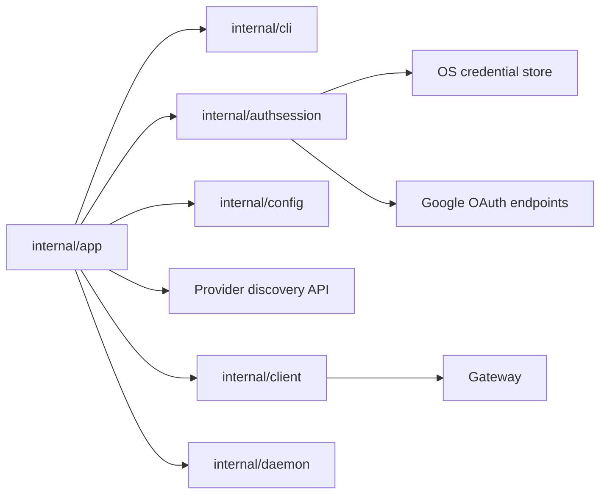

# CLI Auth Component Structure

This document defines the internal component structure for service-discovered
provider auth and the generic OIDC adapter initially used by Google.

It follows:

- CLI guide: [`../user-guides/sqlrs-auth.md`](../user-guides/sqlrs-auth.md)
- Interaction flow: [`cli-auth-flow.md`](cli-auth-flow.md)
- ADR:
  [`../adr/2026-09-24-remote-connection-bootstrap.md`](../adr/2026-09-24-remote-connection-bootstrap.md)

## 1. Scope and assumptions

- The slice covers:
  - `sqlrs auth login <provider>`
  - `sqlrs auth status`
  - `sqlrs auth logout`
  - effective bearer-token resolution for protected remote API commands.
- The first adapter is generic OIDC; the first configured provider is Google.
- The OIDC adapter supports public native clients using Authorization Code,
  PKCE S256, a loopback redirect, ID and refresh tokens, and token endpoint
  authentication method `none`. It also requires RFC 9207 authorization-response
  issuer identification.
- The selected remote profile must use `auth.mode: remoteSession` for
  service-discovered sessions.
- `SQLRS_TOKEN` remains the highest-priority override and bypasses stored
  sessions.
- The gateway accepts only short-lived Google ID tokens. Refresh tokens remain
  client-only.

## 2. Deployment units

### CLI (`frontend/cli-go`)

The CLI owns login orchestration, local session storage, token refresh, command
rendering, and protected-command bearer-token resolution.

| Module | Responsibility |
| --- | --- |
| `internal/app` | Dispatch `auth` commands; resolve profile/mode/output; fetch the selected provider configuration; call the auth session manager; reconcile one organization endpoint; resolve effective bearer tokens before protected commands. |
| `internal/cli` | Define auth command option/result types and human/JSON renderers. Keep token-bearing values out of rendered output. |
| `internal/authsession` | Own provider-adapter dispatch, PKCE, state/nonce generation, auth URL construction from advertised endpoints, login-attempt issuer/redirect binding, loopback validation, token exchange/refresh/revoke, claim decoding, credential-store access, and effective bearer-token selection. |
| `internal/config` | Load stable installation/routing metadata plus `auth.mode`, `auth.tokenEnv`, and legacy `auth.token`. It never stores provider client configuration, refresh tokens, or raw ID tokens. |
| `internal/client` | Own connection-info/provider discovery and sqlrs `/v1/*` API calls. Protected API methods receive an already resolved bearer token. |
| `internal/paths` | Provide OS-specific config/state paths when the auth session manager needs stable application names or diagnostic context. |

Suggested package/file layout:

```text
frontend/cli-go/internal/authsession/
  manager.go
  pkce.go
  claims.go
  oidc.go
  loopback.go
  store.go
  store_windows.go
  store_darwin.go
  store_linux.go
```

The auth session code stays out of `internal/client` so the sqlrs API client
does not also become a Google OAuth client. It stays out of `internal/config`
so config loading does not become session storage.

### Local engine (`backend/local-engine-go`)

No local engine component is added or changed.

The local engine continues to accept its existing local bearer token from
`engine.json` for protected local endpoints. It never sees Google refresh
tokens and does not participate in `sqlrs auth` commands.

### Shared services and gateway

The gateway adds public connection-info, provider collection, and provider
detail routes at the installation base and every candidate organization prefix.
These routes do not validate or disclose organization existence. Protected
requests perform candidate-prefix validation and return `404` according to
their existing disclosure rules.

The service advertises a provider only when the gateway trust configuration
accepts that provider's exact issuer and client ID as an audience. Startup
validates this invariant; inconsistent provider/gateway configuration makes the
bootstrap and provider routes return `503`. Enabling another provider therefore
requires both a supported CLI adapter profile and matching gateway trust.
The gateway maps each trusted issuer/client-ID pair back to the advertised
provider ID; external identity keys use that ID, not adapter name `oidc`.

The gateway must not accept, store, or refresh Google refresh tokens.

## 3. Remote profile configuration

Provider client configuration is removed from workspace ownership:

```go
type AuthConfig struct {
    Mode     string `yaml:"mode"`
    TokenEnv string `yaml:"tokenEnv"`
    Token    string `yaml:"token"`
}
```

Rules:

- `mode: fileToken` remains local-daemon auth.
- `mode: bearer` remains the legacy explicit bearer-token path.
- `mode: remoteSession` enables active provider-session lookup and refresh.
- `tokenEnv` defaults to `SQLRS_TOKEN` for `remoteSession` profiles when omitted.
- `ProfileConfig` owns `installationID`, `installationEndpoint`, mutable request
  `endpoint`, and optional authenticated organization metadata. A path-prefixed
  endpoint obtained from public discovery remains an unverified candidate.
- Provider ID, issuer, client ID, endpoints, scopes, and adapter config version
  come from the provider API and are retained only in session metadata as needed.

## 4. Key types and interfaces

### Bootstrap and provider configuration

`internal/client` decodes wire DTOs and validates all cross-field invariants
before `internal/app` writes config or invokes an auth adapter:

```go
type ConnectionInfo struct {
    InstallationID string
    Endpoints      ConnectionEndpoints
    AuthProviders  []AuthProviderSummary
}

type ConnectionEndpoints struct {
    Control string
    Current string
}

type AuthProviderSummary struct {
    ID          string
    DisplayName string
    Adapter     string
}

type OIDCProviderConfig struct {
    ID                                  string
    DisplayName                         string
    Adapter                             string // "oidc"
    ConfigurationVersion                int    // 1
    Flow                                string // "authorizationCodePKCE"
    Issuer                              string
    ClientID                            string
    AuthorizationEndpoint               string
    TokenEndpoint                       string
    TokenEndpointAuthMethod             string // "none"
    AuthorizationResponseISSSupported    bool   // true
    RevocationEndpoint                  string
    Scopes                              []string
    AuthorizationParameters             map[string]string
}
```

Validation requires unique provider IDs, `openid` in scopes, and exact ID
agreement between the request path and detail response. Login fetches the
detail directly from `<current>/v1/auth/providers/<provider>`; the collection is
for discovery and UI, not a prerequisite for login. An empty provider list is
an error for normal remote-session init.

Service bases use HTTPS, except explicit development HTTP on literal loopback
`127.0.0.1` or `[::1]`. A candidate base is the installation root or exactly
one path segment with the organization-slug grammar. Userinfo, query, fragment,
dot segments, encoded slash/backslash, and trailing slash after normalization
are rejected. OIDC URLs use HTTPS and no userinfo or fragment. Existing OIDC
endpoint query parameters are allowed only when they do not collide with
CLI-owned OAuth parameters. URL validation and joining are structural, never
string-prefix based; bootstrap redirects may not cross origin or downgrade.
Absolute service URLs are derived from trusted deployment configuration, not
an unvalidated HTTP `Host` or forwarding header.

### Auth session manager

`authsession.Manager` is the main package service.

```go
type Manager struct {
    Store CredentialStore
    HTTP  OAuthHTTPClient
    Clock Clock
    Rand  io.Reader
    OpenBrowser BrowserOpener
}
```

Required operations:

- `Login(ctx, ProviderConfig, LoginOptions) (LoginResult, error)`
- `Status(ctx, StatusOptions) (StatusResult, error)`
- `Logout(ctx, LogoutOptions) (LogoutResult, error)`
- `ResolveBearerToken(ctx, ResolveOptions) (ResolvedBearerToken, error)`

### Credential store abstraction

```go
type CredentialStore interface {
    Get(ctx context.Context, key CredentialKey) (Session, bool, error)
    Put(ctx context.Context, key CredentialKey, session Session) error
    Delete(ctx context.Context, key CredentialKey) error
    GetLegacy(ctx context.Context, key LegacyCredentialKey) (Session, bool, error)
    DeleteLegacy(ctx context.Context, key LegacyCredentialKey) error
}
```

Platform implementations:

- Windows: Windows Credential Manager.
- macOS: Keychain.
- Linux: Secret Service/libsecret.

Linux credential-store unavailability returns a clear setup error. There is no
plaintext refresh-token fallback.

### Credential key and session

The active session lookup is scoped only to one remote profile and stable
installation, so it remains discoverable after restart without provider data
in workspace config:

```go
type CredentialKey struct {
    ProfileName         string
    InstallationID      string
    InstallationEndpoint string
}

type LegacyCredentialKey struct {
    ProfileName string
    Endpoint    string
    Provider    string
    Issuer      string
    ClientID    string
}
```

`InstallationEndpoint` is the normalized control base and prevents an unrelated
origin from claiming the same server-supplied installation ID and receiving a
cached token. The session value owns provider, issuer, client ID, and subject.
A successful login atomically replaces the one active session for the key,
including when the provider or account changes. Supporting multiple inactive
sessions later would require a separate persisted active-session reference.

```go
type Session struct {
    Provider      string
    Issuer        string
    ClientID      string
    Subject       string
    Email         string
    Scopes        []string
    RefreshToken  string
    CachedIDToken string
    LoginNonce    string
    IDTokenExpiry time.Time
    CreatedAt     time.Time
    UpdatedAt     time.Time
}
```

`RefreshToken`, `CachedIDToken`, and `LoginNonce` are secret values and must
never be rendered.
`Subject`, `Email`, `Issuer`, `ClientID`, `Scopes`, and expiry timestamps are
safe metadata when printed under the rules in the auth user guide.

### Token and claim types

```go
type PKCEPair struct {
    Verifier  string
    Challenge string
    Method    string // "S256"
}

type IDTokenClaims struct {
    Issuer          string
    Audience        []string
    AuthorizedParty string
    Subject         string
    Email           string
    Expiry          time.Time
    IssuedAt        time.Time
    Nonce           string
}
```

```go
type LoginAttempt struct {
    ProviderID  string
    Issuer      string
    RedirectURI string
    State       string
    Nonce       string
    PKCE        PKCEPair
}
```

Callback processing requires matching state and redirect URI plus an RFC 9207
`iss` exactly equal to the attempt issuer before token exchange.

The CLI decodes ID token claims locally for expiry and diagnostic metadata.
Signature verification remains gateway-owned for API authorization. On login,
local checks require non-empty subject, exact issuer, required issued-at and
expiry claims, future expiry, issued-at no more than five minutes in the future,
matching nonce, and the client ID as the sole audience in configuration version 1;
`azp`, when present, must equal the client ID. Refresh applies the same issuer,
audience, `azp`, issued-at, and expiry checks and requires the subject to equal
the stored session. Refresh does not require nonce, but compares a returned
nonce with the login nonce retained in the credential. A replacement refresh
token is stored atomically with the new ID token.
The CLI supports refresh-token rotation; the provider is responsible for the
sender-constraining or rotation policy required for public clients.

OAuth token and revocation POSTs never follow HTTP redirects. Before refresh,
the current provider detail must retain the session's provider ID, adapter,
issuer, and client ID; a change requires a new login. Transient network errors,
`429`, and `5xx` retain the credential. `invalid_grant` or an equivalent
definitive rejection deletes it. Claim-validation failure retains the refresh
credential for a later retry but never sends the returned ID token to sqlrs APIs. Failure to fetch provider
configuration during logout counts as revocation failure but does not prevent
local deletion.

### Test seams

The component must inject these dependencies rather than using globals directly:

- clock;
- random source;
- OAuth HTTP client;
- browser opener;
- loopback receiver or listener factory;
- credential store.

The concrete tests are designed in the next process stage, after this component
structure is approved.

## 5. Command wiring

### `sqlrs auth login google`

`internal/app` parses flags, resolves the profile, and calls
`authsession.Manager.Login` with the service-advertised `oidc` configuration.

Inputs:

- profile name;
- installation ID, control endpoint, and current bootstrap/request endpoint;
- service-advertised provider ID and versioned adapter configuration;
- optional `--login-hint`;
- `--no-browser`;
- output mode.

Output:

- safe login summary with provider, email, issuer, audience/client ID, profile,
  and endpoint.

### `sqlrs auth status`

`internal/app` calls `authsession.Manager.Status`.

Status inspects:

- whether `SQLRS_TOKEN` override is set;
- whether the selected profile uses `auth.mode: remoteSession`;
- whether the OS credential store contains a local session;
- cached ID-token expiry when available.

It never refreshes solely to print status. It may report that the cached ID
token is expired while the session is still refresh-capable.

### `sqlrs auth logout`

`internal/app` calls `authsession.Manager.Logout`.

Logout attempts Google revocation unless `--no-revoke` is set, then deletes the
local credential store entry. Deletion happens even when revocation fails.

### Protected remote commands

`internal/app` resolves the effective bearer token before constructing command
options for protected remote API commands:

1. If `tokenEnv` or default `SQLRS_TOKEN` is set, use that value for ordinary
   protected commands. Post-login reconciliation is the exception and uses the
   ID token produced by that login.
2. If `auth.mode: remoteSession`, locate the active session by profile and
   installation, then fetch that session provider's current configuration and
   call `Manager.ResolveBearerToken`.
3. If `auth.mode: bearer`, use legacy static bearer behavior.
4. If no token is available for a protected remote request, fail before calling
   `internal/client`.

Local mode continues to use `internal/daemon` and local `fileToken` behavior.

## 6. Data ownership

- **Workspace/global config** owns stable installation/routing settings but not
  provider client configuration, provider selection, refresh tokens, or raw ID
  tokens.
- **Shared installation** owns its provider catalogue and public adapter
  configuration, including the authorization endpoint used to build login URLs.
- **OS credential store** owns refresh tokens and optional cached ID tokens.
- **Auth session metadata** such as provider, issuer, audience, email, subject,
  and expiry is stored with the credential and may be copied into in-memory
  command results.
- **PKCE verifier, state, expected issuer, and exact redirect URI** are
  in-memory only and live for one login attempt. The login nonce is retained
  only inside the credential value so a nonce returned during refresh can be
  compared; it is never rendered.
- **Loopback callback data** is in-memory only and discarded after login
  succeeds or fails.
- **Effective bearer token** is in-memory only for one command invocation.
- **Gateway actor claims** are server-side request context and are not cached by
  the CLI.

## 7. RC profile and credential migration

`auth.mode: oidcSession` is accepted as a deprecated read alias for
`remoteSession`. Until an explicit update, the config loader preserves the
legacy fields in a read-only migration view and existing auth commands continue
to resolve the legacy credential, with a deprecation warning. They do not
silently rewrite the profile. `sqlrs init remote --update` rewrites it to
`remoteSession` and removes legacy `clientID`, `clientSecret`, and `issuer`
fields; a client secret is never retained elsewhere.

When the old profile has enough metadata to derive its legacy credential key
and its normalized origin matches the discovered control-base origin, init migrates it
to `{profileName, installationID, installationEndpoint}` without risking loss.
It never overwrites an existing destination session; if one exists, it is
authoritative and init only commits the new profile metadata. Otherwise init
writes and verifies the destination first, atomically writes config second, and
only then best-effort deletes the legacy entry. A crash may leave both entries
but never neither. On
any earlier failure the legacy credential remains. `--dry-run` performs no
credential writes or deletes. A migrated legacy session has no login nonce; it
remains refresh-capable only while refreshed ID tokens omit nonce. A returned
nonce without a stored comparison value requires a new login. If migration is
impossible, the old credential is left untouched and the user is asked to log
in once. No secret is copied to workspace config. A new CLI contacting an old server without
`/v1/connection-info` returns an actionable server-upgrade error; it does not
silently fall back to an insecure discovery mode. The explicit deprecated
`--token` path remains the deliberate compatibility escape hatch.

The shared service and gateway must be deployed before clients rely on this
contract. This is also required because `Organization.endpoint` becomes a
required v1 response field.

## 8. Dependency diagram



## 9. References

- User guide: [`../user-guides/sqlrs-auth.md`](../user-guides/sqlrs-auth.md)
- Flow: [`cli-auth-flow.md`](cli-auth-flow.md)
- CLI contract: [`cli-contract.md`](cli-contract.md)
- General CLI component structure:
  [`cli-component-structure.md`](cli-component-structure.md)
