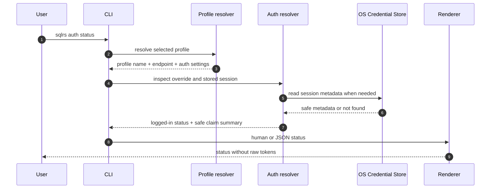
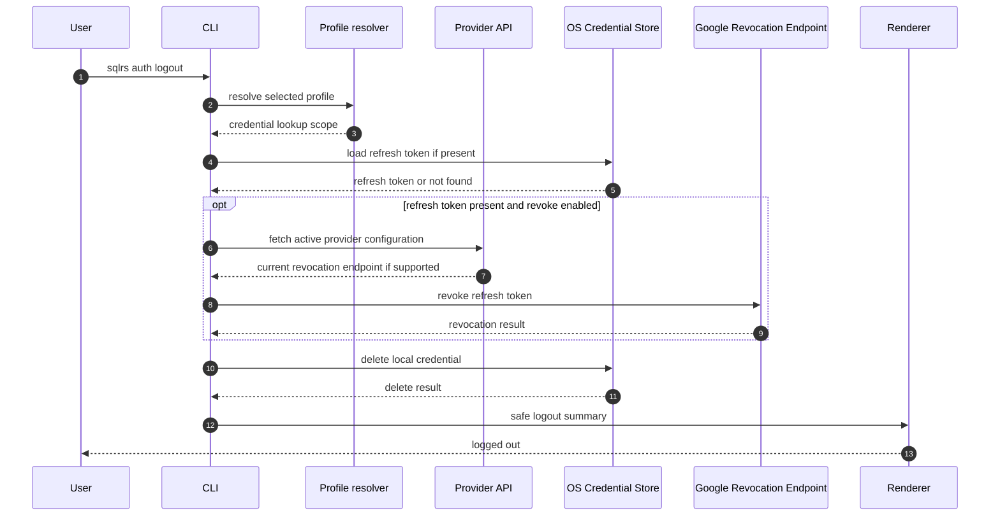

# Поток CLI Auth

Этот документ описывает service-discovered provider login и универсальный OIDC
CLI adapter, первоначально настроенный для Google.

Он следует утвержденному CLI-синтаксису в
[`../user-guides/sqlrs-auth.md`](../user-guides/sqlrs-auth.md) и принятому
решению в
[`../adr/2026-09-24-remote-connection-bootstrap.md`](../adr/2026-09-24-remote-connection-bootstrap.md).

Gateway предоставляет public connection/provider discovery routes и по-прежнему
получает только short-lived Google ID token как bearer token.

## 1. Scope

В scope:

- `sqlrs auth login <provider>` с первым реализованным OIDC adapter,
  первоначально настроенным для Google
- `sqlrs auth status`
- `sqlrs auth logout`
- effective bearer-token resolution для protected remote API commands

Вне scope:

- server-side refresh-token storage;
- изменения local engine auth;
- provider adapters для протоколов за пределами поддерживаемого OIDC
  native-client profile;
- device code flow, если loopback login позже не окажется impractical.

## 2. Участники

- **User** - вызывает `sqlrs auth` или protected remote command.
- **CLI parser** - разбирает global flags, profile, output mode и auth
  subcommand arguments.
- **Profile resolver** - загружает выбранный profile, stable installation ID и
  control endpoint, текущий request endpoint, `auth.mode` и имя debug override
  environment variable.
- **Provider API** - публично перечисляет enabled providers и возвращает
  актуальную versioned adapter configuration на installation base и под любым
  candidate organization prefix, не подтверждая существование организации.
- **Auth resolver** - владеет auth-session decisions для одного CLI invocation:
  приоритет `SQLRS_TOKEN`, проверки expiry cached ID token, refresh и
  login-required errors.
- **Loopback listener** - слушает `127.0.0.1:<random-port>` во время login и
  получает Google authorization callback.
- **Browser** - открывает Google authorization URL для user consent.
- **Google Authorization Endpoint** - возвращает authorization code через
  loopback redirect.
- **Google Token Endpoint** - обменивает authorization code и refresh token на
  ID token-ы.
- **Google Revocation Endpoint** - revoke-ит refresh token во время logout,
  если это возможно.
- **OS Credential Store** - хранит refresh token и optional cached ID token:
  Windows Credential Manager, macOS Keychain или Linux Secret Service/libsecret.
- **HTTP client** - отправляет sqlrs API requests с effective bearer token.
- **Gateway** - проверяет short-lived Google ID token и выводит actor claims.
- **Renderer** - печатает human или JSON output без raw token-ов.

## 3. Flow: `sqlrs auth login google`

```mermaid
sequenceDiagram
  autonumber
  participant USER as User
  participant CLI as CLI
  participant PROFILE as Profile resolver
  participant PROVIDERS as Provider API
  participant LPB as Loopback listener
  participant BROWSER as Browser
  participant GOOGLE_AUTH as Google Authorization Endpoint
  participant GOOGLE_TOKEN as Google Token Endpoint
  participant STORE as OS Credential Store
  participant CURRENT as Current request API
  participant CONFIG as Workspace config
  participant RENDER as Renderer

  USER->>CLI: sqlrs auth login google
  CLI->>PROFILE: resolve selected profile
  PROFILE-->>CLI: installation identity + control endpoint + auth.mode=remoteSession
  CLI->>PROVIDERS: GET /v1/auth/providers/google
  PROVIDERS-->>CLI: versioned OIDC config для provider google
  CLI->>CLI: bind provider + issuer + redirect URI; generate PKCE, state, nonce
  CLI->>LPB: listen on loopback random port
  CLI->>BROWSER: open URL from advertised authorizationEndpoint
  BROWSER->>GOOGLE_AUTH: user consent
  GOOGLE_AUTH-->>LPB: redirect with code + state + iss
  LPB-->>CLI: callback query
  CLI->>CLI: validate state, redirect URI, callback iss и parameters
  CLI->>GOOGLE_TOKEN: exchange code + PKCE verifier
  GOOGLE_TOKEN-->>CLI: id_token + refresh_token + expiry
  CLI->>CLI: require sub/iat/exp; validate iss, aud, azp, iat, exp, nonce
  CLI->>STORE: atomically replace active session
  CLI->>CURRENT: GET /v1/users/me with new login ID token
  alt candidate-prefixed endpoint authenticated и visible
    CURRENT-->>CLI: matching organization + canonical endpoint
    CLI->>CONFIG: bind authenticated organization metadata (URL unchanged)
  else one membership and profile installation-root scoped
    CURRENT-->>CLI: canonical organization endpoint
    CLI->>CONFIG: atomic selected-profile endpoint update
    CLI-->>USER: stderr profile-switch warning
  else zero or multiple memberships
    CURRENT-->>CLI: no unambiguous switch
  else root endpoint и current user не registered
    CURRENT-->>CLI: 404 user profile not found
    CLI-->>USER: exit 0; suggest sqlrs user register
  else candidate prefix не существует или не visible
    CURRENT-->>CLI: 404
    CLI-->>USER: retain session; partial-success exit 1
  else reconciliation или config update fails
    CLI-->>USER: retain session; partial-success exit 1 + recovery
  end
  CLI->>RENDER: safe login summary
  RENDER-->>USER: logged in
```

Rules:

- Callback принимается только на `127.0.0.1`.
- `state` mismatch, OAuth `error` или missing `code` завершают login до token
  exchange.
- Missing или mismatched RFC 9207 callback `iss`, а также callback на redirect
  URI, не совпадающий с bound attempt URI, завершают login до token exchange.
- Missing `refresh_token` завершает login с troubleshooting hint. Объявленные
  Google authorization parameters запрашивают offline access через
  `access_type=offline` и `prompt=consent`.
- Универсальный OIDC adapter принимает только Authorization Code с PKCE S256,
  loopback redirect, ID и refresh tokens и token endpoint authentication method
  `none`.
- Authorization URL начинается с service-advertised `authorizationEndpoint`;
  CLI владеет security-sensitive параметрами login attempt.
- Существующие query parameters authorization endpoint не должны конфликтовать
  с parameters, которыми владеет CLI.
- Public provider configuration никогда не содержит confidential client secret.
- Refresh token хранится только в OS credential store.
- Raw refresh token-ы и raw ID token-ы никогда не печатаются.
- Post-login reconciliation всегда использует ID token, выданный этим login;
  `SQLRS_TOKEN` не может подменить identity на этом шаге.
- Успешный public bootstrap не аутентифицирует path prefix. Первый protected
  current-user request проверяет candidate-prefixed endpoint.
- Root и syntactically valid candidate bootstrap requests используют один
  installation-owned handler и data без organization-store lookup; status,
  body semantics и cache behavior отличаются только URL-derived current fields.
  Invalid candidate syntax можно отклонить до этого handler.
- Current-user `404` на installation root означает успешный login, но еще не
  registered user. Тот же HTTP status на candidate-prefixed endpoint означает
  invalid или non-visible organization candidate.
- Canonical organization endpoint trusted только на installation control origin,
  с ровно одним valid slug segment и без userinfo, query или fragment. Для
  custom domains потребуется будущий explicit allowlist.

## 4. Flow: Protected Remote API Token Resolution

```mermaid
sequenceDiagram
  autonumber
  participant USER as User
  participant CLI as CLI
  participant PROFILE as Profile resolver
  participant AUTH as Auth resolver
  participant STORE as OS Credential Store
  participant PROVIDERS as Provider API
  participant GOOGLE_TOKEN as Google Token Endpoint
  participant CLIENT as HTTP client
  participant GW as Gateway

  USER->>CLI: sqlrs protected remote command
  CLI->>PROFILE: resolve selected profile
  PROFILE-->>CLI: remote endpoint + auth settings
  CLI->>AUTH: resolve effective bearer token
  alt SQLRS_TOKEN is set
    AUTH-->>CLI: token from environment override
  else auth.mode is remoteSession
    AUTH->>STORE: load local session
    STORE-->>AUTH: provider identity + refresh token + cached ID token metadata
    alt cached ID token is fresh
      AUTH-->>CLI: cached ID token
    else cached ID token missing or expiring soon
      AUTH->>PROVIDERS: GET /v1/auth/providers/{active provider}
      PROVIDERS-->>AUTH: current provider configuration
      AUTH->>AUTH: require same provider, adapter, issuer и client ID
      AUTH->>GOOGLE_TOKEN: refresh_token grant + public client_id
      GOOGLE_TOKEN-->>AUTH: new ID token + optional rotated refresh token
      AUTH->>AUTH: validate iss, aud, azp, iat, exp, subject; optional nonce
      AUTH->>STORE: atomically update ID token and rotated refresh token
      AUTH-->>CLI: new ID token
    end
  else legacy bearer profile
    AUTH-->>CLI: static profile token or no-token error
  end
  CLI->>CLIENT: protected API request + bearer token
  CLIENT->>GW: Authorization bearer ID token
  GW-->>CLIENT: API response
  CLIENT-->>CLI: result or mapped error
  CLI-->>USER: rendered command output
```

Rules:

- `SQLRS_TOKEN` имеет приоритет над stored sessions и static profile token-ами.
- OIDC sessions refresh-ят cached ID token, когда он missing, expired или
  истекает в течение пяти минут.
- Refresh требует original subject, exact issuer, sole client-ID audience,
  valid `azp`, issued-at не более чем на пять минут в будущем и future expiry.
  Nonce optional, но если
  возвращен, должен совпасть со stored login nonce. Returned replacement
  refresh token сохраняется атомарно.
- Refresh-token failures останавливают команду до protected sqlrs API request
  и предлагают пользователю выполнить `sqlrs auth login google`.
- Token и revocation POST никогда не следуют redirects. Transient network
  errors, `429` и `5xx` сохраняют session. `invalid_grant` или equivalent
  definitive rejection удаляет credential.
  Изменение provider identity/config binding требует login без refresh request.
- Gateway получает только effective bearer token. Он никогда не получает
  refresh token.

## 5. Flow: `sqlrs auth status`



Rules:

- Status показывает `logged in` или `not logged in`, provider, email, issuer,
  audience/client ID, token expiry, profile, endpoint и override source.
- Если `SQLRS_TOKEN` задан, status показывает override без вывода его value.
- Verbose output может включать только safe claim summary fields: `iss`, `aud`,
  masked `sub`, `email` и `exp`.

## 6. Flow: `sqlrs auth logout`



Rules:

- `logout` удаляет local credentials, даже если Google revocation failed.
- Failure provider-configuration lookup считается revocation failure и не
  мешает local deletion. Revocation POST никогда не следует redirects.
- `--no-revoke` пропускает Google revocation request.
- `logout` не unset-ит и не меняет `SQLRS_TOKEN`.
- Команда idempotent, когда local session отсутствует.

## 7. Failure Handling

| Failure | Behavior |
| --- | --- |
| Local profile selected | Fail before opening browser or reading credentials. |
| `auth.mode` is not `remoteSession` for login | Fail with profile configuration guidance. |
| Provider не объявлен сервисом | Fail до открытия browser. |
| Provider adapter/config version не поддерживается | Fail с actionable ошибкой обновления CLI или provider support. |
| В provider configuration отсутствует authorization или token endpoint | Fail до генерации login attempt. |
| Provider ID не совпадает с requested path | Fail до открытия browser. |
| Bootstrap redirect меняет origin или делает HTTPS downgrade | Reject response. |
| Credential store unavailable | Fail without plaintext refresh-token fallback. |
| Callback `state` mismatch | Fail login and discard callback data. |
| Callback contains OAuth `error` | Fail login with the provider error summary. |
| Callback is missing `code` | Fail login before token exchange. |
| Token endpoint omits `refresh_token` on login | Fail login and suggest consent/client configuration checks. |
| Login ID token не содержит `sub`, `iat` или `exp` | Reject login и не сохранять session. |
| Provider ID, adapter, issuer или client ID меняется до refresh | Require login без отправки refresh token. |
| Refresh transport failure, `429` или `5xx` | Retain session и вернуть retryable error. |
| Refreshed token меняет issuer, subject, audience/`azp` или имеет invalid required claims/nonce | Retain refresh credential, reject token и не вызывать protected API. |
| Cached ID token expired and refresh succeeds | Atomically store new ID token и rotated refresh token, если он возвращен, затем continue. |
| Refresh token revoked или definitively rejected | Delete local session и предложить `sqlrs auth login google`. |
| Gateway rejects ID token with `401` | Surface the API auth error; audience/issuer troubleshooting belongs in the auth guide. |
| Root current-user lookup возвращает `404` после login | Exit zero, retain session и предложить user registration. |
| Candidate current-user lookup возвращает `404` после login | Retain session и вернуть partial-success exit `1` с endpoint recovery. |
| Reconciliation network/5xx или local profile update fails | Retain session и вернуть partial-success exit `1`. |

## 8. Security Invariants

- Refresh token-ы никогда не покидают client machine, кроме запросов к Google
  token или revocation endpoint.
- sqlrs gateway никогда не получает refresh token-ы.
- Workspace config хранит только non-secret auth configuration.
- Raw refresh token-ы и raw ID token-ы никогда не печатаются в normal, JSON или
  verbose output.
- Loopback listener bind-ится только к `127.0.0.1` и принимает один callback
  для одной login attempt.
- `state` и `nonce` high entropy и single-use.
- PKCE использует `S256`.
- Credential lookup включает canonical installation control endpoint, поэтому
  другой origin не может переиспользовать server-supplied installation ID.
- OAuth token и revocation POST requests никогда не следуют redirects.

## 9. References

- User guide: [`../user-guides/sqlrs-auth.md`](../user-guides/sqlrs-auth.md)
- ADR: [`../adr/2026-07-01-google-oidc-cli-auth.md`](../adr/2026-07-01-google-oidc-cli-auth.md)
- CLI contract: [`cli-contract.RU.md`](cli-contract.RU.md)
- CLI architecture: [`cli-architecture.RU.md`](cli-architecture.RU.md)
- CLI auth component structure:
  [`cli-auth-component-structure.RU.md`](cli-auth-component-structure.RU.md)
- User/org flow: [`user-org-flow.RU.md`](user-org-flow.RU.md)
