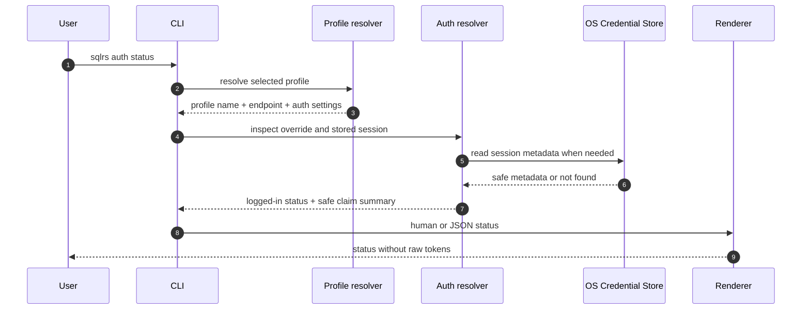
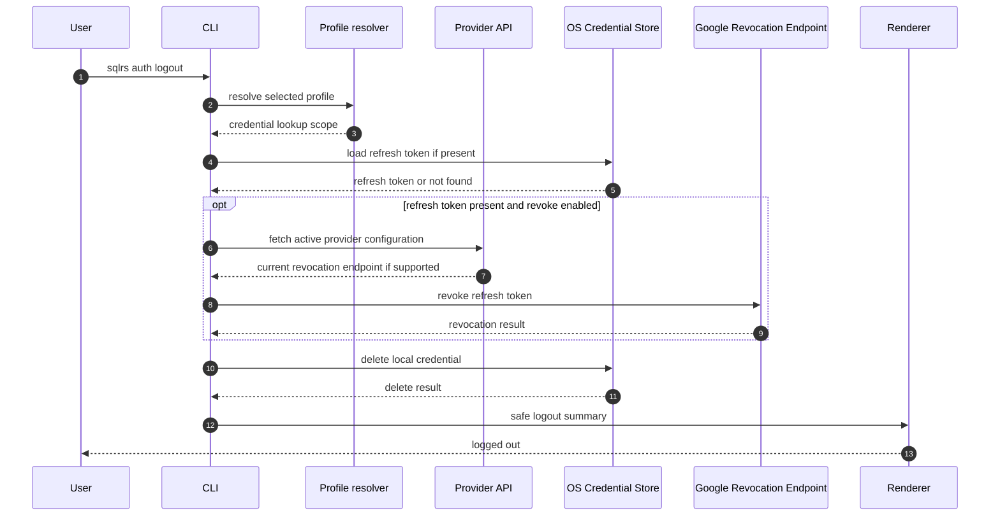

# CLI Auth Flow

This document describes service-discovered provider login and the generic OIDC
CLI adapter initially configured for Google.

It follows the approved CLI syntax in
[`../user-guides/sqlrs-auth.md`](../user-guides/sqlrs-auth.md) and the accepted
decision in
[`../adr/2026-09-24-remote-connection-bootstrap.md`](../adr/2026-09-24-remote-connection-bootstrap.md).

The gateway exposes public connection/provider discovery routes and continues
to receive only short-lived Google ID tokens as bearer tokens.

## 1. Scope

In scope:

- `sqlrs auth login <provider>` with the OIDC adapter implemented first and
  initially configured for Google
- `sqlrs auth status`
- `sqlrs auth logout`
- effective bearer-token resolution for protected remote API commands

Out of scope:

- server-side refresh-token storage;
- local engine auth changes;
- provider adapters for protocols outside the supported OIDC native-client
  profile;
- device code flow unless loopback login later proves impractical.

## 2. Participants

- **User** - invokes `sqlrs auth` or a protected remote command.
- **CLI parser** - parses global flags, profile, output mode, and auth
  subcommand arguments.
- **Profile resolver** - loads the selected profile, stable installation ID and
  control endpoint, current request endpoint, `auth.mode`, and debug override
  environment variable name.
- **Provider API** - publicly lists enabled providers and returns the current
  versioned adapter configuration at the installation root and every candidate
  organization prefix without confirming organization existence.
- **Auth resolver** - owns auth-session decisions for one CLI invocation:
  `SQLRS_TOKEN` priority, cached ID-token expiry checks, refresh, and
  login-required errors.
- **Loopback listener** - listens on `127.0.0.1:<random-port>` during login and
  receives the Google authorization callback.
- **Browser** - opens the Google authorization URL for user consent.
- **Google Authorization Endpoint** - returns the authorization code through
  the loopback redirect.
- **Google Token Endpoint** - exchanges authorization codes and refresh tokens
  for ID tokens.
- **Google Revocation Endpoint** - revokes refresh tokens during logout when
  possible.
- **OS Credential Store** - stores refresh tokens and optional cached ID tokens:
  Windows Credential Manager, macOS Keychain, or Linux Secret Service/libsecret.
- **HTTP client** - sends sqlrs API requests with the effective bearer token.
- **Gateway** - validates short-lived Google ID tokens and derives actor claims.
- **Renderer** - prints human or JSON output without raw tokens.

## 3. Flow: `sqlrs auth login google`

```mermaid
sequenceDiagram
  autonumber
  participant USER as User
  participant CLI as CLI
  participant PROFILE as Profile resolver
  participant PROVIDERS as Provider API
  participant LPB as Loopback listener
  participant BROWSER as Browser
  participant GOOGLE_AUTH as Google Authorization Endpoint
  participant GOOGLE_TOKEN as Google Token Endpoint
  participant STORE as OS Credential Store
  participant CURRENT as Current request API
  participant CONFIG as Workspace config
  participant RENDER as Renderer

  USER->>CLI: sqlrs auth login google
  CLI->>PROFILE: resolve selected profile
  PROFILE-->>CLI: installation identity + control endpoint + auth.mode=remoteSession
  CLI->>PROVIDERS: GET /v1/auth/providers/google
  PROVIDERS-->>CLI: versioned OIDC config for provider google
  CLI->>CLI: bind provider + issuer + redirect URI; generate PKCE, state, nonce
  CLI->>LPB: listen on loopback random port
  CLI->>BROWSER: open URL built from advertised authorizationEndpoint
  BROWSER->>GOOGLE_AUTH: user consent
  GOOGLE_AUTH-->>LPB: redirect with code + state + iss
  LPB-->>CLI: callback query
  CLI->>CLI: validate state, redirect URI, callback iss, and parameters
  CLI->>GOOGLE_TOKEN: exchange code + PKCE verifier
  GOOGLE_TOKEN-->>CLI: id_token + refresh_token + expiry
  CLI->>CLI: require sub/iat/exp; validate iss, aud, azp, iat, exp, nonce
  CLI->>STORE: atomically replace active session
  CLI->>CURRENT: GET /v1/users/me with the new login ID token
  alt candidate-prefixed endpoint is authenticated and visible
    CURRENT-->>CLI: matching organization + canonical endpoint
    CLI->>CONFIG: bind authenticated organization metadata (URL unchanged)
  else one membership and profile is installation-root scoped
    CURRENT-->>CLI: canonical organization endpoint
    CLI->>CONFIG: atomic selected-profile endpoint update
    CLI-->>USER: stderr profile-switch warning
  else zero or multiple memberships
    CURRENT-->>CLI: no unambiguous switch
  else root endpoint and current user is not registered
    CURRENT-->>CLI: 404 user profile not found
    CLI-->>USER: exit 0; suggest sqlrs user register
  else candidate prefix does not exist or is not visible
    CURRENT-->>CLI: 404
    CLI-->>USER: retain session; partial-success exit 1
  else reconciliation or config update fails
    CLI-->>USER: retain session; partial-success exit 1 + recovery
  end
  CLI->>RENDER: safe login summary
  RENDER-->>USER: logged in
```

Rules:

- The callback is accepted only on `127.0.0.1`.
- `state` mismatch, OAuth `error`, or missing `code` fails login before token
  exchange.
- Missing or mismatched RFC 9207 callback `iss`, or a callback received on a
  different redirect URI than the one bound to the attempt, fails login before
  token exchange.
- Missing `refresh_token` fails login with a troubleshooting hint. Google's
  advertised authorization parameters request offline access with
  `access_type=offline` and `prompt=consent`.
- The generic OIDC adapter accepts only Authorization Code with PKCE S256,
  loopback redirect, ID and refresh tokens, and token endpoint authentication
  method `none`.
- The authorization URL starts with the service-advertised
  `authorizationEndpoint`; the CLI owns security-sensitive attempt parameters.
- Existing authorization-endpoint query parameters must not collide with those
  CLI-owned parameters.
- Public provider configuration never includes a confidential client secret.
- The refresh token is stored only in the OS credential store.
- Raw refresh tokens and raw ID tokens are never printed.
- Post-login reconciliation always uses the ID token issued by that login;
  `SQLRS_TOKEN` cannot substitute another identity for this step.
- Public bootstrap success does not authenticate a path prefix. The first
  protected current-user request validates a candidate-prefixed endpoint.
- Root and syntactically valid candidate bootstrap requests use the same
  installation-owned handler and data without an organization-store lookup;
  status, body semantics, and cache behavior differ only in URL-derived current
  fields. Invalid candidate syntax may be rejected before that handler.
- A current-user `404` at the installation root means that login succeeded but
  the user is not registered yet. The same HTTP status at a candidate-prefixed
  endpoint is treated as an invalid or non-visible organization candidate.
- A canonical organization endpoint is trusted only on the installation
  control origin with exactly one valid slug segment and no userinfo, query, or
  fragment. Custom domains require a future explicit allowlist.

## 4. Flow: Protected Remote API Token Resolution

```mermaid
sequenceDiagram
  autonumber
  participant USER as User
  participant CLI as CLI
  participant PROFILE as Profile resolver
  participant AUTH as Auth resolver
  participant STORE as OS Credential Store
  participant PROVIDERS as Provider API
  participant GOOGLE_TOKEN as Google Token Endpoint
  participant CLIENT as HTTP client
  participant GW as Gateway

  USER->>CLI: sqlrs protected remote command
  CLI->>PROFILE: resolve selected profile
  PROFILE-->>CLI: remote endpoint + auth settings
  CLI->>AUTH: resolve effective bearer token
  alt SQLRS_TOKEN is set
    AUTH-->>CLI: token from environment override
  else auth.mode is remoteSession
    AUTH->>STORE: load local session
    STORE-->>AUTH: provider identity + refresh token + cached ID token metadata
    alt cached ID token is fresh
      AUTH-->>CLI: cached ID token
    else cached ID token missing or expiring soon
      AUTH->>PROVIDERS: GET /v1/auth/providers/{active provider}
      PROVIDERS-->>AUTH: current provider configuration
      AUTH->>AUTH: require same provider, adapter, issuer, and client ID
      AUTH->>GOOGLE_TOKEN: refresh_token grant + public client_id
      GOOGLE_TOKEN-->>AUTH: new ID token + optional rotated refresh token
      AUTH->>AUTH: validate iss, aud, azp, iat, exp, subject; optional nonce
      AUTH->>STORE: atomically update ID token and rotated refresh token
      AUTH-->>CLI: new ID token
    end
  else legacy bearer profile
    AUTH-->>CLI: static profile token or no-token error
  end
  CLI->>CLIENT: protected API request + bearer token
  CLIENT->>GW: Authorization bearer ID token
  GW-->>CLIENT: API response
  CLIENT-->>CLI: result or mapped error
  CLI-->>USER: rendered command output
```

Rules:

- `SQLRS_TOKEN` has priority over stored sessions and static profile tokens.
- OIDC sessions refresh cached ID tokens when they are missing, expired, or
  within five minutes of expiry.
- Refresh requires the original subject, exact issuer, sole client-ID audience,
  valid `azp`, issued-at no more than five minutes in the future, and future
  expiry. Nonce is optional but, when
  returned, must equal the stored login nonce. A replacement refresh token is
  stored atomically.
- Refresh-token failures stop the command before the protected sqlrs API
  request and tell the user to run `sqlrs auth login google`.
- Token and revocation POSTs never follow redirects. Transient network errors,
  `429`, and `5xx` retain the session. `invalid_grant` or equivalent definitive
  rejection deletes it. Provider identity/config binding
  changes require login and no refresh request is sent.
- The gateway receives only the effective bearer token. It never receives the
  refresh token.

## 5. Flow: `sqlrs auth status`



Rules:

- Status reports `logged in` or `not logged in`, provider, email, issuer,
  audience/client ID, token expiry, profile, endpoint, and override source.
- If `SQLRS_TOKEN` is set, status reports the override without printing its
  value.
- Verbose output may include only safe claim summary fields: `iss`, `aud`,
  masked `sub`, `email`, and `exp`.

## 6. Flow: `sqlrs auth logout`



Rules:

- `logout` deletes local credentials even if Google revocation fails.
- Provider-configuration lookup failure is treated as revocation failure and
  does not prevent local deletion. Revocation POST never follows redirects.
- `--no-revoke` skips the Google revocation request.
- `logout` does not unset or modify `SQLRS_TOKEN`.
- The command is idempotent when no local session exists.

## 7. Failure Handling

| Failure | Behavior |
| --- | --- |
| Local profile selected | Fail before opening browser or reading credentials. |
| `auth.mode` is not `remoteSession` for login | Fail with profile configuration guidance. |
| Provider is not advertised | Fail before opening a browser. |
| Provider adapter/config version is unsupported | Fail with an actionable CLI upgrade or provider-support error. |
| Provider configuration omits authorization or token endpoint | Fail before generating a login attempt. |
| Provider ID differs from the requested path | Fail before opening a browser. |
| Bootstrap redirect changes origin or downgrades HTTPS | Reject the response. |
| Credential store unavailable | Fail without plaintext refresh-token fallback. |
| Callback `state` mismatch | Fail login and discard callback data. |
| Callback contains OAuth `error` | Fail login with the provider error summary. |
| Callback is missing `code` | Fail login before token exchange. |
| Token endpoint omits `refresh_token` on login | Fail login and suggest consent/client configuration checks. |
| Login ID token omits `sub`, `iat`, or `exp` | Reject login and store no session. |
| Provider ID, adapter, issuer, or client ID changes before refresh | Require login without sending the refresh token. |
| Refresh transport failure, `429`, or `5xx` | Retain the session and return a retryable error. |
| Refreshed token changes issuer, subject, audience/`azp`, or has invalid required claims/nonce | Retain the refresh credential, reject the token, and do not call the protected API. |
| Cached ID token expired and refresh succeeds | Atomically store the new ID token and any rotated refresh token, then continue. |
| Refresh token revoked or definitively rejected | Delete the local session and tell the user to run `sqlrs auth login google`. |
| Gateway rejects ID token with `401` | Surface the API auth error; audience/issuer troubleshooting belongs in the auth guide. |
| Root current-user lookup returns `404` after login | Exit zero, retain the session, and suggest user registration. |
| Candidate current-user lookup returns `404` after login | Retain the session and return partial-success exit `1` with endpoint recovery. |
| Reconciliation network/5xx or local profile update fails | Retain the session and return partial-success exit `1`. |

## 8. Security Invariants

- Refresh tokens never leave the client machine except to Google's token or
  revocation endpoint.
- The sqlrs gateway never receives refresh tokens.
- Workspace config stores only non-secret auth configuration.
- Raw refresh tokens and raw ID tokens are never printed in normal, JSON, or
  verbose output.
- The loopback listener binds only to `127.0.0.1` and accepts one callback for
  one login attempt.
- `state` and `nonce` are high entropy and single-use.
- PKCE uses `S256`.
- Credential lookup includes the canonical installation control endpoint, so a
  different origin cannot reuse a server-supplied installation ID.
- OAuth token and revocation POST requests never follow redirects.

## 9. References

- User guide: [`../user-guides/sqlrs-auth.md`](../user-guides/sqlrs-auth.md)
- ADR: [`../adr/2026-07-01-google-oidc-cli-auth.md`](../adr/2026-07-01-google-oidc-cli-auth.md)
- CLI contract: [`cli-contract.md`](cli-contract.md)
- CLI architecture: [`cli-architecture.md`](cli-architecture.md)
- CLI auth component structure:
  [`cli-auth-component-structure.md`](cli-auth-component-structure.md)
- User/org flow: [`user-org-flow.md`](user-org-flow.md)
