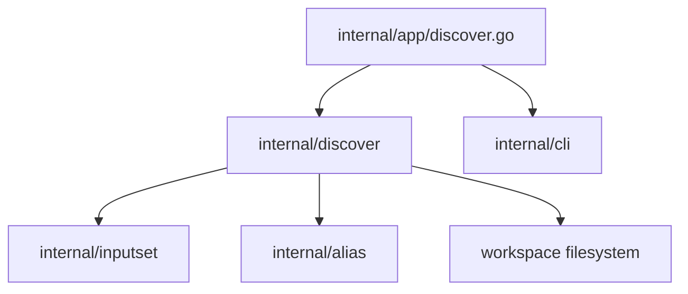

# Структура компонента Discover

Этот документ описывает реализованную структуру компонентов local-команды
`sqlrs discover`.

## 1. Границы

- Feature полностью реализована в `frontend/cli-go`.
- У неё нет engine API или persistence layer.
- Она читает bounded workspace и возвращает in-memory report.
- Она никогда не пишет файлы репозитория; follow-up commands существуют только
  как output artifacts.
- Analyzer selection additive и нормализуется в canonical order.

## 2. Реализованные модули

| Module | Реализованная ответственность |
| --- | --- |
| `internal/app/discover.go` | Парсить discover flags, разрешать CLI context, выбирать progress mode, запускать анализ и выбирать human или JSON output. |
| `internal/discover/registry.go` | Stable analyzer names, registry, canonical ordering, удаление дубликатов и нормализация shell family. |
| `internal/discover/generic.go` | Запускать выбранные analyzers, преобразовывать analyzer errors в findings, агрегировать counters, findings и summaries. |
| `internal/discover/types.go`, `report.go` | Data shapes для report, finding, analyzer summary и follow-up command. |
| `internal/discover/aliases.go`, `aliases_phases.go` | Alias-oriented orchestration и границы phases. |
| `internal/discover/scan.go`, `score.go`, `validate.go`, `graph.go` | Workspace scanning, candidate scoring, kind-specific validation и root ranking для aliases analyzer. |
| `internal/discover/coverage.go` | Загрузка repo-tracked alias coverage и исключение покрытых suggestions. |
| `internal/discover/followup.go` | Рендеринг команд `sqlrs alias create` с platform-aware quoting. |
| `internal/discover/gitignore.go` | Поиск ignore gaps для `.sqlrs/` и `coverage-current` и рендеринг append commands. |
| `internal/discover/vscode.go` | Merge sqlrs YAML schema mapping в payload `.vscode/settings.json` и рендеринг write command. |
| `internal/discover/prepare_shaping.go` | Поиск смеси stable/volatile filename tokens в каждой директории. |
| `internal/discover/progress.go` | Типы и отправка progress events. |
| `internal/cli/commands_discover.go` | Рендеринг human report blocks. |
| `internal/cli/discover_usage.go` | Рендеринг command help. |
| `internal/inputset` | Shared file-bearing collection при валидации alias candidates. |
| `internal/alias` | Alias-file inventory и ref/path rules, переиспользуемые для coverage. |

## 3. Оркестрация

```text
internal/app
  -> normalize selection in internal/discover/registry.go
  -> run internal/discover/generic.go
       -> run each registered analyzer in canonical order
       -> convert analyzer errors into invalid findings
       -> aggregate summaries and findings
  -> render human blocks or serialize JSON
```

Registry содержит четыре function runners:

- `AnalyzeAliases`
- `AnalyzeGitignore`
- `AnalyzeVSCode`
- `AnalyzePrepareShaping`

Отдельного public analyzer interface нет. Package registry хранит функции с
internal-сигнатурой `analyzerRunner`.

## 4. Владение analyzers

### Aliases

Aliases analyzer владеет более глубоким workflow pipeline:

```text
alias coverage
-> workspace scan
-> candidate scoring
-> kind-specific validation and input closure collection
-> graph-based root ranking
-> coverage suppression
-> alias-create command rendering
```

Его collectors переиспользуют `internal/inputset`; остальные три analyzers
используют собственные bounded filesystem heuristics.

### Gitignore

`gitignore.go` владеет artifact discovery, проверкой точных entries, выбором
target `.gitignore` и рендерингом PowerShell/POSIX append command.

### VS Code

`vscode.go` владеет чтением и parsing `.vscode/settings.json`, обеспечением
`yaml.schemas` mapping, сериализацией полного merged payload и рендерингом
PowerShell/POSIX write command. Он не проверяет `extensions.json`.

### Prepare shaping

`prepare_shaping.go` владеет обходом supported extensions и filename-token
classification. Он не использует input closures, dependency graphs или alias
coverage.

## 5. Data types и владение

- `discover.Options` содержит workspace root, cwd, selected analyzers, shell
  family и optional progress sink.
- `discover.Report` содержит selected analyzers, per-analyzer summaries,
  aggregate alias-pipeline counters и findings.
- `discover.Finding` содержит shared advisory fields и alias-specific fields.
- `discover.FollowUpCommand` содержит shell family и command text.
- Workspace scan records, candidates, closures и parsed JSON живут только одну
  invocation.
- App владеет выбором output mode; он не входит в `discover.Options`.

## 6. Dependency diagram



`backend/local-engine-go` и remote services находятся вне этого dependency
graph.

## 7. Ссылки

- User guide: [`../user-guides/sqlrs-discover.md`](../user-guides/sqlrs-discover.md)
- Interaction flow: [`discover-flow.RU.md`](discover-flow.RU.md)
- CLI contract: [`cli-contract.RU.md`](cli-contract.RU.md)
- Alias creation: [`alias-create-component-structure.RU.md`](alias-create-component-structure.RU.md)
- Input collection: [`inputset-component-structure.RU.md`](inputset-component-structure.RU.md)
