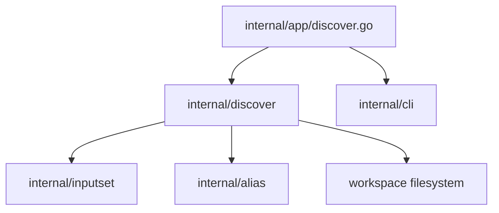

# Discover Component Structure

This document describes the implemented component structure of the local
`sqlrs discover` command.

## 1. Boundaries

- The feature is implemented entirely in `frontend/cli-go`.
- It has no engine API or persistence layer.
- It reads a bounded workspace and returns an in-memory report.
- It never writes repository files; follow-up commands are output artifacts.
- Analyzer selection is additive and normalized to canonical order.

## 2. Implemented modules

| Module | Implemented responsibility |
| --- | --- |
| `internal/app/discover.go` | Parse discover flags, resolve CLI context, select progress mode, invoke analysis, and choose human or JSON output. |
| `internal/discover/registry.go` | Stable analyzer names, registry, canonical ordering, duplicate removal, and shell-family normalization. |
| `internal/discover/generic.go` | Run selected analyzers, convert analyzer errors to findings, aggregate counters, findings, and summaries. |
| `internal/discover/types.go`, `report.go` | Report, finding, analyzer summary, and follow-up command data shapes. |
| `internal/discover/aliases.go`, `aliases_phases.go` | Alias-oriented orchestration and phase boundaries. |
| `internal/discover/scan.go`, `score.go`, `validate.go`, `graph.go` | Workspace scanning, candidate scoring, kind-specific validation, and root ranking used by the aliases analyzer. |
| `internal/discover/coverage.go` | Load repo-tracked alias coverage and suppress covered suggestions. |
| `internal/discover/followup.go` | Render `sqlrs alias create` commands with platform-aware quoting. |
| `internal/discover/gitignore.go` | Detect `.sqlrs/` and `coverage-current` ignore gaps and render append commands. |
| `internal/discover/vscode.go` | Merge the sqlrs YAML schema mapping into a `.vscode/settings.json` payload and render a write command. |
| `internal/discover/prepare_shaping.go` | Detect stable/volatile filename-token mixtures per directory. |
| `internal/discover/progress.go` | Progress event types and emission. |
| `internal/cli/commands_discover.go` | Render human report blocks. |
| `internal/cli/discover_usage.go` | Render command help. |
| `internal/inputset` | Shared file-bearing collection used while validating alias candidates. |
| `internal/alias` | Alias-file inventory and ref/path rules reused for coverage. |

## 3. Orchestration

```text
internal/app
  -> normalize selection in internal/discover/registry.go
  -> run internal/discover/generic.go
       -> run each registered analyzer in canonical order
       -> convert analyzer errors into invalid findings
       -> aggregate summaries and findings
  -> render human blocks or serialize JSON
```

The registry contains four function runners:

- `AnalyzeAliases`
- `AnalyzeGitignore`
- `AnalyzeVSCode`
- `AnalyzePrepareShaping`

There is no separate public analyzer interface. The package registry stores
functions with the internal `analyzerRunner` signature.

## 4. Analyzer ownership

### Aliases

The aliases analyzer owns the deeper workflow pipeline:

```text
alias coverage
-> workspace scan
-> candidate scoring
-> kind-specific validation and input closure collection
-> graph-based root ranking
-> coverage suppression
-> alias-create command rendering
```

Its collectors reuse `internal/inputset`; the other three analyzers use their
own bounded filesystem heuristics.

### Gitignore

`gitignore.go` owns artifact discovery, exact-entry checks, target
`.gitignore` selection, and PowerShell/POSIX append command rendering.

### VS Code

`vscode.go` owns reading and parsing `.vscode/settings.json`, ensuring the
`yaml.schemas` mapping, serializing the complete merged payload, and rendering
the PowerShell/POSIX write command. It does not inspect `extensions.json`.

### Prepare shaping

`prepare_shaping.go` owns the supported-extension walk and filename-token
classification. It does not use input closures, dependency graphs, or alias
coverage.

## 5. Data types and ownership

- `discover.Options` contains workspace root, cwd, selected analyzers, shell
  family, and an optional progress sink.
- `discover.Report` contains selected analyzers, per-analyzer summaries,
  aggregate alias-pipeline counters, and findings.
- `discover.Finding` contains shared advisory fields plus alias-specific fields.
- `discover.FollowUpCommand` contains shell family and command text.
- Workspace scan records, candidates, closures, and parsed JSON live only for
  one invocation.
- The app owns output-mode selection; it is not part of `discover.Options`.

## 6. Dependency diagram



`backend/local-engine-go` and remote services are outside this dependency
graph.

## 7. References

- User guide: [`../user-guides/sqlrs-discover.md`](../user-guides/sqlrs-discover.md)
- Interaction flow: [`discover-flow.md`](discover-flow.md)
- CLI contract: [`cli-contract.md`](cli-contract.md)
- Alias creation: [`alias-create-component-structure.md`](alias-create-component-structure.md)
- Input collection: [`inputset-component-structure.md`](inputset-component-structure.md)
