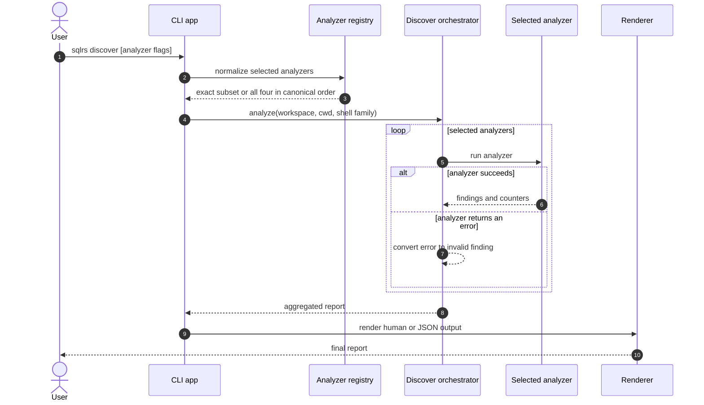

# Поток Discover

Этот документ описывает реализованный local-only interaction flow команды
`sqlrs discover`.

Команда advisory и read-only. Она не обращается к engine, не запускает
контейнеры, не разрешает Git refs и не изменяет файлы репозитория.

## 1. Участники

- **Пользователь** - запускает `sqlrs discover`.
- **Command context** - предоставляет workspace root, cwd, shell family, output
  mode и progress rendering.
- **Analyzer registry** - нормализует выбор analyzers и canonical order.
- **Discover orchestrator** - запускает выбранные analyzers, изолирует
  analyzer-level failures и агрегирует reports.
- **Aliases analyzer** - сканирует и валидирует вероятные workflow roots,
  исключает существующее alias coverage и формирует предложения
  `sqlrs alias create`.
- **Gitignore analyzer** - проверяет ignore coverage для `.sqlrs/` и artifacts
  `coverage-current`.
- **VS Code analyzer** - проверяет sqlrs YAML schema mapping в
  `.vscode/settings.json`.
- **Prepare-shaping analyzer** - сообщает о директориях, где имена файлов
  смешивают stable и volatile preparation tokens.
- **Renderer** - печатает human blocks или JSON report.

## 2. Interaction flow



## 3. Потоки analyzers

### 3.1 Выбор analyzers

- Без analyzer flags выбираются `aliases`, `gitignore`, `vscode` и
  `prepare-shaping`.
- Явные flags additive.
- Повторные flags игнорируются.
- Execution и output grouping всегда используют canonical order.
- Неизвестные discover options являются usage errors.

### 3.2 `--aliases`

Aliases analyzer:

1. загружает repo-tracked prepare/run alias coverage;
2. обходит workspace files и оценивает вероятные workflow roots;
3. валидирует перспективные candidates через kind-specific input collection;
4. ранжирует validated roots и исключает candidates, уже покрытые aliases;
5. создает предложенные ref, alias path, rationale и команду
   `sqlrs alias create ...`.

Команда существует только в output; analyzer не создает alias file.

### 3.3 `--gitignore`

Gitignore analyzer проверяет уже существующие artifacts:

- если workspace содержит `.sqlrs/`, workspace-root `.gitignore` проверяется на
  точный entry `.sqlrs/`;
- для каждого файла с именем `coverage-current` проверяется `.gitignore` в той
  же директории на точный entry `coverage-current`;
- при поиске coverage artifacts не обходятся деревья `.git`, `.sqlrs`,
  `node_modules` и `vendor`.

Каждый отсутствующий entry формирует finding с target path и PowerShell- или
POSIX-командой, которая выполняет проверку перед добавлением.

### 3.4 `--vscode`

VS Code analyzer читает `.vscode/settings.json` и проверяет mapping:

```json
{
  "yaml.schemas": {
    "./.vscode/sqlrs-workspace-config.schema.json": [
      "**/.sqlrs/config.yaml"
    ]
  }
}
```

Отсутствующий или пустой файл считается пустым JSON object. Для существующего
object unrelated top-level settings сохраняются в merged payload. Finding
содержит полный payload и shell-native команду для его записи. Invalid JSON
превращается в invalid advisory finding.

### 3.5 `--prepare-shaping`

Prepare-shaping analyzer обходит `.sql`, `.xml`, `.yaml`, `.yml` и `.json`
файлы вне деревьев `.git`, `.sqlrs`, `node_modules` и `vendor`. Файлы
группируются по директориям и классифицируются по имени:

- stable tokens: `schema`, `init`, `ddl`, `base`;
- volatile tokens: `seed`, `demo`, `sample`, `data`.

Директория с обоими классами формирует одно advisory-предложение разделить
stable schema/bootstrap preparation и volatile seed/demo inputs. Analyzer не
разбирает include или changelog graphs и не проверяет alias layouts.

## 4. Output и progress

- Human output начинается с selected analyzers и aggregate counters.
- Findings нумеруются и группируются по analyzer в canonical order.
- Alias findings используют alias-specific fields; остальные analyzers — общие
  target/action/reason/payload/command fields.
- JSON output сериализует `discover.Report`, включая analyzer summaries и
  findings.
- Обычный interactive mode использует delayed spinner в `stderr`.
- Verbose mode пишет line-based analyzer/stage/candidate progress в `stderr`.
- `stdout` зарезервирован для финального report.

## 5. Обработка ошибок

- Parser и analyzer-selection errors завершают команду usage error.
- Analyzer-level error преобразуется в invalid finding; остальные выбранные
  analyzers продолжают работу.
- Candidate validation failures в aliases analyzer остаются candidate findings.
- Invalid VS Code JSON становится finding для manual inspection.
- Ни один failure path не разрешает `discover` изменять файлы репозитория.

## 6. Ссылки

- User guide: [`../user-guides/sqlrs-discover.md`](../user-guides/sqlrs-discover.md)
- Component structure: [`discover-component-structure.RU.md`](discover-component-structure.RU.md)
- CLI contract: [`cli-contract.RU.md`](cli-contract.RU.md)
