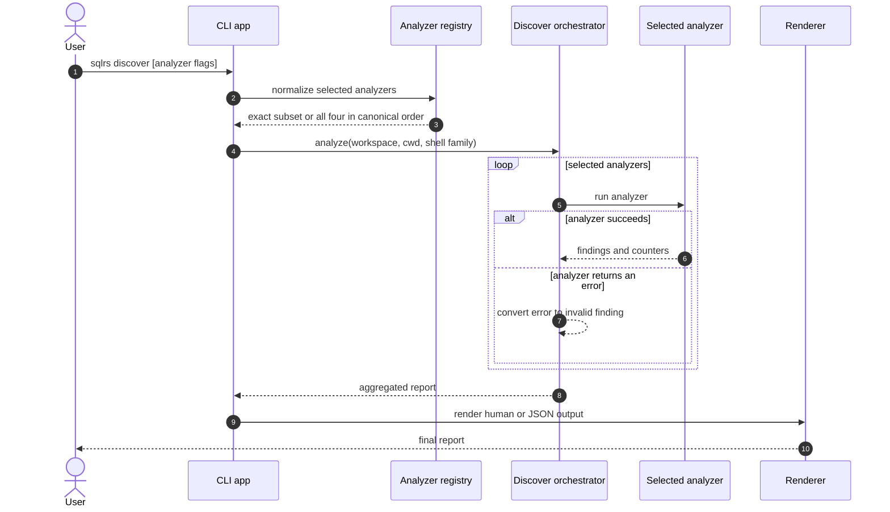

# Discover Flow

This document describes the implemented local-only interaction flow for
`sqlrs discover`.

The command is advisory and read-only. It does not contact the engine, start
containers, resolve Git refs, or modify repository files.

## 1. Participants

- **User** - invokes `sqlrs discover`.
- **Command context** - supplies workspace root, cwd, shell family, output mode,
  and progress rendering.
- **Analyzer registry** - normalizes analyzer selection and canonical order.
- **Discover orchestrator** - runs selected analyzers, isolates analyzer-level
  failures, and aggregates reports.
- **Aliases analyzer** - scans and validates likely workflow roots, suppresses
  existing alias coverage, and renders `sqlrs alias create` suggestions.
- **Gitignore analyzer** - checks ignore coverage for `.sqlrs/` and
  `coverage-current` artifacts.
- **VS Code analyzer** - checks the sqlrs YAML schema mapping in
  `.vscode/settings.json`.
- **Prepare-shaping analyzer** - reports directories whose filenames mix stable
  and volatile preparation tokens.
- **Renderer** - prints human blocks or the JSON report.

## 2. Interaction flow



## 3. Analyzer flows

### 3.1 Analyzer selection

- No analyzer flags selects `aliases`, `gitignore`, `vscode`, and
  `prepare-shaping`.
- Explicit flags are additive.
- Duplicate flags are ignored.
- Execution and output grouping always use canonical order.
- Unknown discover options are usage errors.

### 3.2 `--aliases`

The aliases analyzer:

1. loads repo-tracked prepare/run alias coverage;
2. walks workspace files and scores likely workflow roots;
3. validates promising candidates with kind-specific input collection;
4. ranks validated roots and suppresses candidates already covered by aliases;
5. emits a suggested ref, alias path, rationale, and
   `sqlrs alias create ...` command.

The command is output only; the analyzer does not create the alias file.

### 3.3 `--gitignore`

The gitignore analyzer inspects artifacts that already exist:

- if the workspace contains `.sqlrs/`, it checks the workspace-root
  `.gitignore` for the exact `.sqlrs/` entry;
- for every file named `coverage-current`, it checks a `.gitignore` in the same
  directory for the exact `coverage-current` entry;
- `.git`, `.sqlrs`, `node_modules`, and `vendor` trees are not traversed while
  looking for coverage artifacts.

Each missing entry produces a finding with the target path and a PowerShell or
POSIX command that checks before appending.

### 3.4 `--vscode`

The VS Code analyzer reads `.vscode/settings.json` and ensures this mapping:

```json
{
  "yaml.schemas": {
    "./.vscode/sqlrs-workspace-config.schema.json": [
      "**/.sqlrs/config.yaml"
    ]
  }
}
```

A missing or empty file is treated as an empty JSON object. For an existing
object, unrelated top-level settings are retained in the merged payload. The
finding contains that complete payload and a shell-native command that writes
it. Invalid JSON becomes an invalid advisory finding.

### 3.5 `--prepare-shaping`

The prepare-shaping analyzer walks `.sql`, `.xml`, `.yaml`, `.yml`, and `.json`
files outside `.git`, `.sqlrs`, `node_modules`, and `vendor` trees. Files are
grouped by directory and classified by filename:

- stable tokens: `schema`, `init`, `ddl`, `base`;
- volatile tokens: `seed`, `demo`, `sample`, `data`.

A directory containing both classes produces one advisory suggestion to split
stable schema/bootstrap preparation from volatile seed/demo inputs. The
analyzer does not parse include or changelog graphs and does not inspect alias
layouts.

## 4. Output and progress

- Human output begins with selected analyzers and aggregate counters.
- Findings are numbered and grouped by analyzer in canonical order.
- Alias findings use alias-specific fields; other analyzers use the shared
  target/action/reason/payload/command fields.
- JSON output serializes `discover.Report`, including analyzer summaries and
  findings.
- Normal interactive mode uses a delayed spinner on `stderr`.
- Verbose mode emits line-based analyzer/stage/candidate progress on `stderr`.
- `stdout` is reserved for the final report.

## 5. Failure handling

- Parser and analyzer-selection errors terminate with a usage error.
- An analyzer-level error is converted into an invalid finding; remaining
  selected analyzers still run.
- Candidate validation failures in the aliases analyzer remain candidate
  findings.
- Invalid VS Code JSON becomes a manual-inspection finding.
- No failure path authorizes `discover` to write repository files.

## 6. References

- User guide: [`../user-guides/sqlrs-discover.md`](../user-guides/sqlrs-discover.md)
- Component structure: [`discover-component-structure.md`](discover-component-structure.md)
- CLI contract: [`cli-contract.md`](cli-contract.md)
