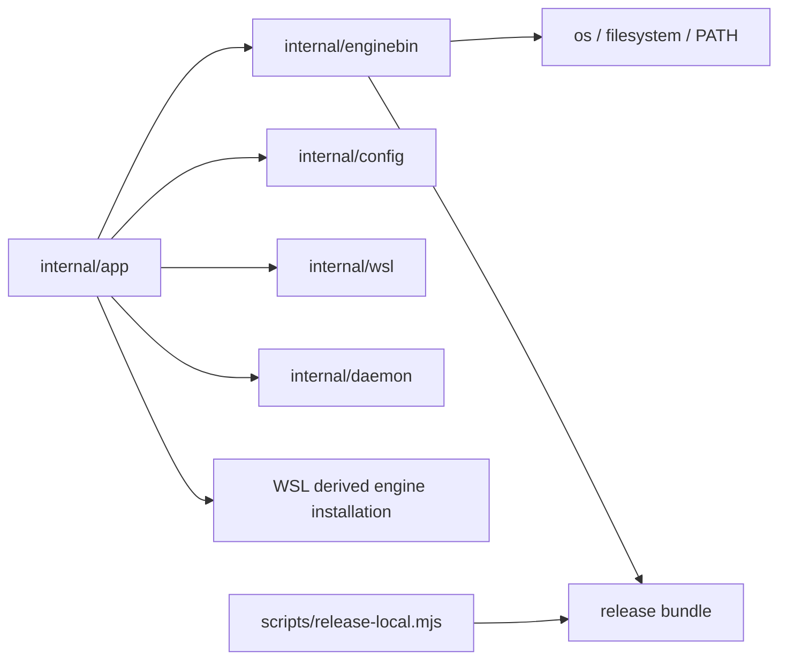

# Компонентная структура discovery бинарников локального engine

## Deployment units

Изменение затрагивает два существующих deployment unit:

- `frontend/cli-go`: discovery, проверка, оркестрация WSL provisioning и выбор
  runtime;
- release archives из `scripts/release-local.mjs`: неизменяемые native и
  companion engine payload.

Сам executable локального engine не получает новых обязанностей. API и схема БД
не меняются.

## CLI packages

### `internal/enginebin`

Владеет platform-neutral политикой discovery и проверки бинарников.

Ключевые типы:

- `Kind`: `Host` или `WSLPayload`;
- `Origin`: `Explicit`, `Environment`, `Config`, `Bundle` или `Path`;
- `Request`: target OS/architecture, путь исполняемого CLI, explicit/config
  candidate, environment candidate и разрешение `PATH` fallback;
- `Resolved`: абсолютный source path, kind, origin, обнаруженный executable
  format и architecture;
- `Resolver`: разрешает candidates в документированном порядке.

Интерфейсы, внедряемые для тестов:

- resolver executable path (`os.Executable` в production);
- command lookup (`exec.LookPath` в production);
- операции inspection/open над filesystem.

Пакет проверяет PE, ELF или Mach-O format и architecture до возврата candidate. Он не читает
workspace config, не выполняет WSL-команды, не копирует файлы и не хранит state.

### `internal/app`

Сохраняет orchestration ownership:

- `runInit` определяет нужные runtime binaries из выбора snapshot/store;
- сборка command context переводит typed config и environment values в
  `enginebin.Request`;
- package-local WSL provisioning устанавливает найденный Linux source через
  временную копию, executable permissions, проверку установленного файла и
  атомарное переименование;
- существующие WSL bootstrap/storage helpers продолжают владеть lifecycle
  distro и btrfs.

Путь установки в WSL — `~/.local/lib/sqlrs/sqlrs-engine`. Он сохраняется как
`engine.wsl.enginePath`. Замена безопасна: неудачная временная копия не заменяет
предыдущий валидный бинарник.

### `internal/config`

Продолжает владеть parsing и merged configuration. Он предоставляет:

- `orchestrator.daemonPath` как override нативного host engine;
- `engine.wsl.enginePath` как установленный Linux path внутри WSL.

Discovery в пакет не входит. Новый persisted config key не требуется.

### `internal/wsl`

Продолжает владеть примитивами WSL availability и выбора distro. Он не выбирает
engine candidates и не владеет структурой bundle.

### `internal/daemon`

Получает полностью разрешённую runtime command из `internal/app`. Он по-прежнему
отвечает за lock, запуск процесса, health polling и `engine.json`, но не за
discovery executable.

## Release packaging

`scripts/release-local.mjs` сохраняет `--engine-bin` для native target engine.
Для Windows target он дополнительно требует:

```text
--wsl-engine-bin <linux-elf-path>
```

Packager проверяет ELF companion и кладёт его в
`libexec/linux-<arch>/sqlrs-engine`. Non-Windows targets отклоняют дополнительный
аргумент, чтобы не создавать неоднозначные архивы.

Release E2E распаковывает только Windows release archive для Windows scenarios.
Он обязан проверить наличие обоих engine и использовать bundled companion для
WSL init. Загрузка отдельного Linux archive больше не считается проверкой
публикуемого Windows artifact.

## Владение данными

- Immutable release data: CLI, native engine и WSL payload внутри archive.
- User configuration: `.sqlrs/config.yaml`.
- Derived global runtime data: `~/.local/lib/sqlrs/sqlrs-engine` внутри
  выбранного WSL distro.
- Ephemeral data: списки candidates, результаты validation и временные install
  paths.

Credentials, engine auth tokens и пользовательские source data не попадают в
discovery или packaging state.

## Направление зависимостей



`internal/enginebin` не должен зависеть от `internal/app`, `internal/config`,
`internal/wsl` или `internal/daemon`.
