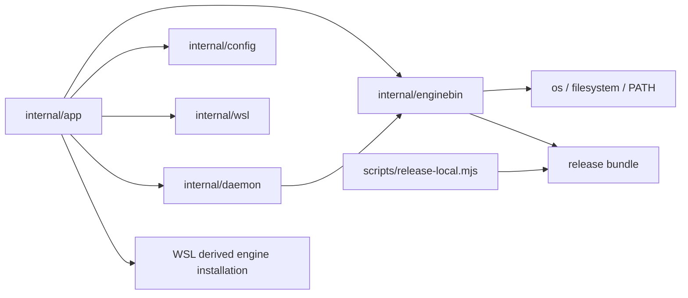

# Local Engine Binary Discovery Component Structure

## Deployment Units

The change affects two existing deployment units:

- `frontend/cli-go`: discovery, validation, WSL provisioning orchestration, and
  runtime selection;
- release archives produced by `scripts/release-local.mjs`: immutable native
  and companion engine payloads.

The local engine executable itself gains no new responsibility. There are no API
or database-schema changes.

## CLI Packages

### `internal/enginebin`

Owns platform-neutral binary discovery and validation policy.

Key types:

- `Kind`: `Host` or `WSLPayload`;
- `Origin`: `Explicit`, `Environment`, `Config`, `Bundle`, or `Path`;
- `Request`: target OS/architecture, CLI executable path, explicit/config
  candidate, environment candidate, and whether `PATH` fallback is allowed;
- `Resolved`: absolute source path, kind, origin, detected executable format,
  and architecture;
- `Resolver`: resolves candidates in documented precedence order.

Key interfaces injected for tests:

- executable-path resolver (`os.Executable` in production);
- command lookup (`exec.LookPath` in production);
- filesystem inspection/open operations.

The package validates PE, ELF, or Mach-O format and architecture before returning a
candidate. It does not read workspace config, execute WSL commands, copy files,
or persist state.

### `internal/app`

Retains orchestration ownership:

- `runInit` determines which runtime binaries are required from snapshot/store
  selection;
- command-context construction maps typed config and environment values into a
  deferred runtime candidate;
- package-local WSL provisioning installs the resolved Linux source by copying
  to a temporary file, setting executable permissions, validating the installed
  file, and atomically renaming it;
- existing WSL bootstrap/storage helpers remain responsible for distro and
  btrfs lifecycle.

The WSL installation destination is
`~/.local/lib/sqlrs/sqlrs-engine`. The installed path is persisted as
`engine.wsl.enginePath`. Installation is replace-safe; a failed temporary copy
does not replace a previously valid binary.

### `internal/config`

Continues to own parsing and merged configuration. It exposes:

- `orchestrator.daemonPath` as the native host override;
- `engine.wsl.enginePath` as the installed Linux path inside WSL.

It does not perform discovery. No new persisted config key is required.

### `internal/wsl`

Continues to own WSL availability and distro-selection primitives. It does not
choose engine candidates or own bundle layout.

### `internal/daemon`

Receives a deferred runtime candidate from `internal/app`. It remains
responsible for lock acquisition, process start, health polling, and
`engine.json`. After the final locked health check and only when a new process
must be started, it resolves the native host engine through `internal/enginebin`
or validates the configured installed WSL engine path.

## Release Packaging

`scripts/release-local.mjs` keeps `--engine-bin` for the native target engine.
For a Windows target it additionally requires:

```text
--wsl-engine-bin <linux-elf-path>
```

The packager validates that the companion is ELF and stages it at
`libexec/linux-<arch>/sqlrs-engine`. Non-Windows targets reject the additional
argument to prevent ambiguous archives.

Release E2E extracts only the Windows release archive for Windows scenarios. It
must assert that both engines exist and must use the bundled companion for WSL
init. Downloading a separate Linux archive would no longer validate the
published Windows artifact.

## Data Ownership

- Immutable release data: CLI, native engine, and WSL payload in the archive.
- User configuration: `.sqlrs/config.yaml`.
- Derived global runtime data: `~/.local/lib/sqlrs/sqlrs-engine` inside the
  selected WSL distro.
- Ephemeral data: candidate lists, validation results, and temporary install
  paths.

No credentials, engine auth tokens, or submitted source data enter discovery
or packaging state.

## Dependency Direction



`internal/enginebin` must not depend on `internal/app`, `internal/config`,
`internal/wsl`, or `internal/daemon`.
