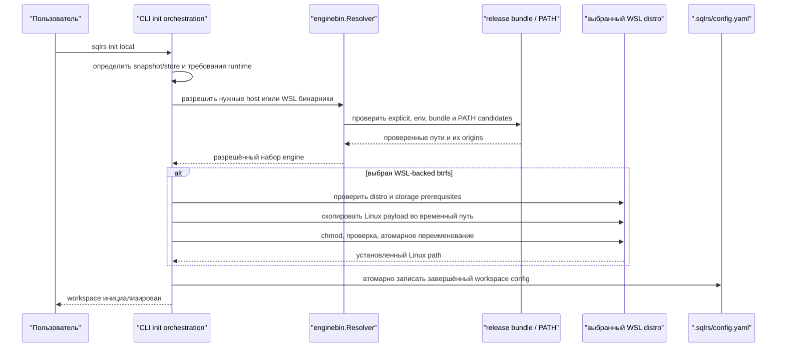
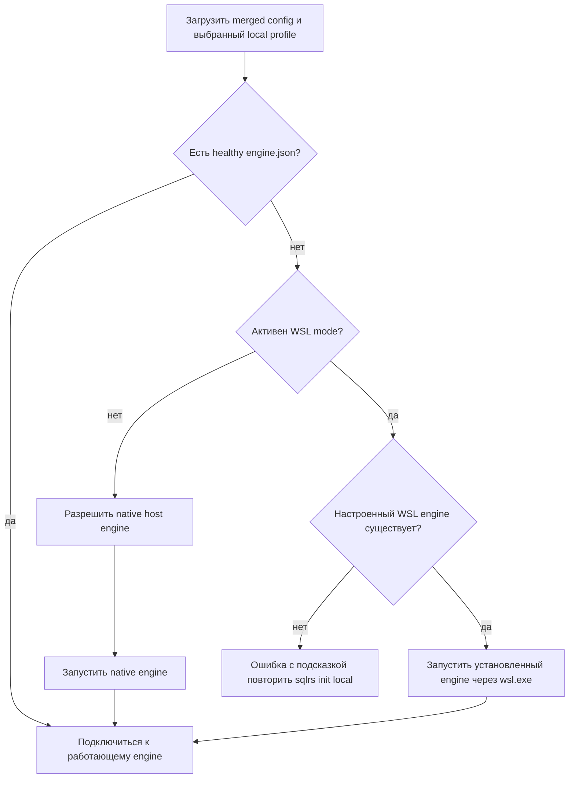

# Поток обнаружения бинарников локального engine

## Область

Документ определяет, как CLI выбирает и устанавливает исполняемые бинарники
engine для local-профилей. Он охватывает нативное выполнение в
Linux/macOS/Windows и WSL2 runtime с CLI на Windows host. HTTP API engine и схемы
хранения не меняются.

CLI-синтаксис и приоритеты определены в
[`../user-guides/sqlrs-init.md`](../user-guides/sqlrs-init.md). Решения записаны
в [`../adr/2026-08-22-local-engine-binary-discovery.md`](../adr/2026-08-22-local-engine-binary-discovery.md).

## Структура релиза

Нативные Linux- и macOS-бандлы содержат CLI и соответствующий нативный engine.
Windows amd64 бандл содержит:

```text
sqlrs.exe
sqlrs-engine.exe
libexec/
  linux-amd64/
    sqlrs-engine
```

Файлы распакованного релиза — неизменяемые входные данные дистрибутива.
Установленный в WSL engine является производным runtime-состоянием.

## Инициализация нового workspace



Discovery и проверка формата бинарника выполняются до записи workspace config.
Отсутствующий payload релиза — ошибка установки, а не повод для capability
fallback. При `--snapshot auto` отсутствие возможностей WSL/btrfs может выбрать
нативный Windows runtime с copy, но повреждённый бандл возвращает ошибку.

## Восстановление существующего workspace

Валидный существующий config принадлежит пользователю и не переписывается
обычным идемпотентным init. Для WSL-backed workspace init также проверяет
установленный Linux engine:

1. Если файл существует и является совместимым ELF, init завершается без изменений.
2. Если файл отсутствует или невалиден, init разрешает WSL payload из бандла и
   атомарно переустанавливает производный файл по настроенному пути.
3. Если config создан до появления `engine.wsl.enginePath`, init принимает
   legacy ELF source из `orchestrator.daemonPath`, устанавливает его в WSL и
   требует `--update` для записи нового установленного пути. Без `--update` он
   печатает точную команду обновления и не меняет пользовательский config.
4. Неудачное восстановление оставляет прежний config и прежний валидный engine
   без изменений.

## Автозапуск обычной командой



Обычные команды не устанавливают и не восстанавливают бинарники. Поэтому
`status`, `prepare` и остальные operational-команды не вносят неожиданных
глобальных изменений.

## Правила ошибок и диагностики

- Ошибка называет требуемый runtime (`host` или `wsl`), все проверенные классы
  источников и подходящий init flag или environment variable.
- Диагностика может показывать пути, но не токены из `engine.json`.
- Невалидный CLI или environment candidate немедленно возвращает ошибку без fallback к
  bundle или `PATH`.
- Bundle-relative discovery начинается от `os.Executable`, а не от cwd.
- `PATH` служит fallback только для native engine. Произвольный Linux engine из
  Windows host `PATH` не принимается как WSL payload.
