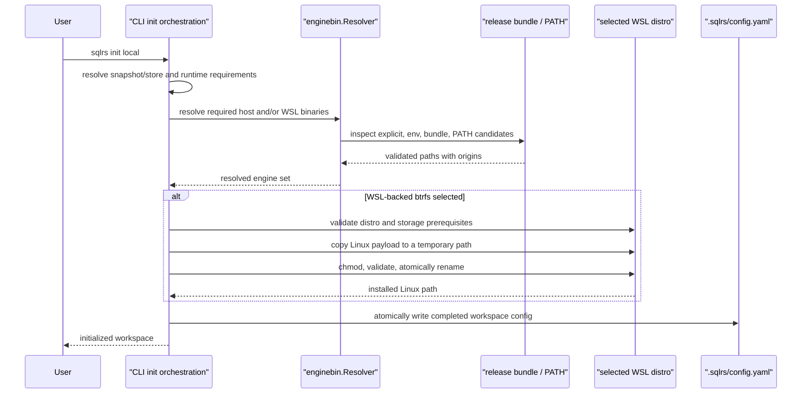
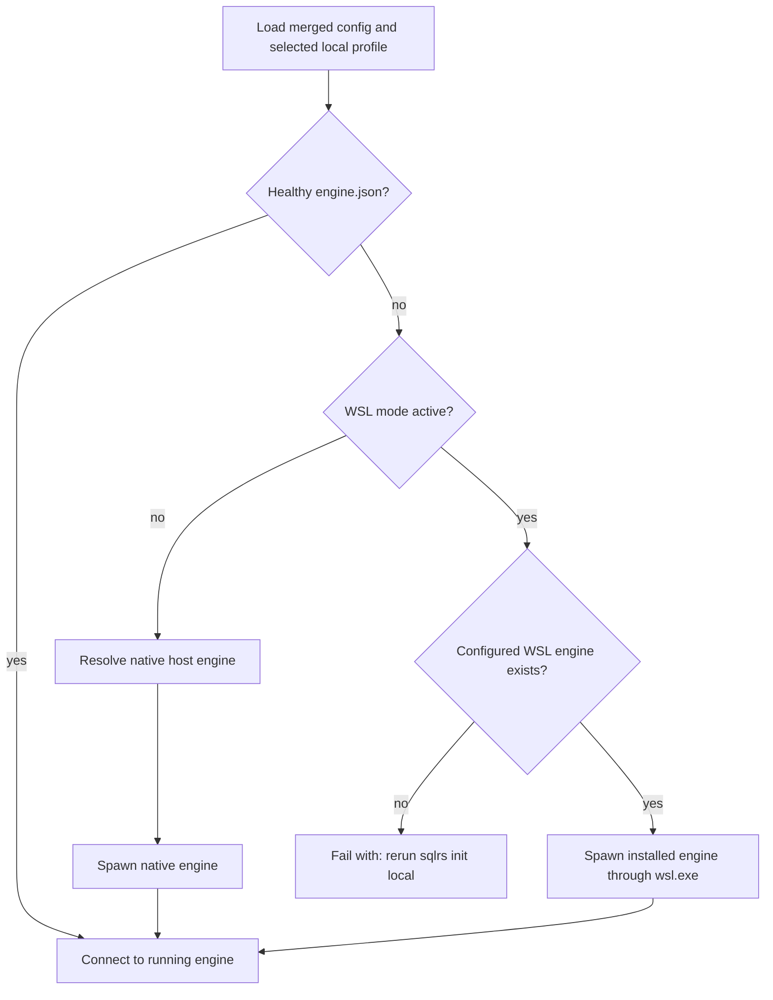

# Local Engine Binary Discovery Flow

## Scope

This document defines how the CLI selects and provisions executable engine
binaries for local profiles. It covers native Linux/macOS/Windows execution and
the Windows-hosted WSL2 runtime. It does not change engine HTTP APIs or storage
schemas.

The CLI syntax and precedence are defined in
[`../user-guides/sqlrs-init.md`](../user-guides/sqlrs-init.md). The decision
record is
[`../adr/2026-08-22-local-engine-binary-discovery.md`](../adr/2026-08-22-local-engine-binary-discovery.md).

## Release Layout

Native Linux and macOS bundles contain the CLI and matching native engine.
Windows amd64 bundles contain:

```text
sqlrs.exe
sqlrs-engine.exe
libexec/
  linux-amd64/
    sqlrs-engine
```

The files under the extracted release root are immutable distribution inputs.
The WSL-installed engine is derived runtime state.

## New Workspace Initialization



Discovery and binary-format validation happen before workspace configuration is
written. A missing release payload is an installation error, not a platform
capability fallback. With `--snapshot auto`, lack of WSL/btrfs capability may
select the native Windows copy runtime, but a corrupt bundle is reported.

## Existing Workspace Repair

An existing valid configuration remains user-owned and is not rewritten by
plain idempotent init. For a WSL-backed workspace, init additionally verifies
the configured installed Linux engine:

1. If it exists and is a compatible ELF binary, init succeeds without changes.
2. If it is missing or invalid, init resolves the bundled WSL payload and
   atomically reinstalls the derived file at the configured path.
3. If the config predates `engine.wsl.enginePath`, init accepts a legacy ELF
   source in `orchestrator.daemonPath`, installs it into WSL, and requires
   `--update` before recording the new installed path. Without `--update`, it
   prints the exact update command instead of silently changing user config.
4. A failed repair leaves the prior configuration and prior valid installed
   engine untouched.

## Normal Command Auto-Start



Normal commands do not install or repair binaries. This keeps `status`,
`prepare`, and other operational commands free of unexpected global mutations.

## Failure and Diagnostic Rules

- Errors identify the required runtime (`host` or `wsl`), every discovery class
  attempted, and the corrective init flag or environment variable.
- Diagnostics may show filesystem paths but never tokens from `engine.json`.
- Explicit CLI or environment candidates fail immediately; they do not silently fall
  through to bundle or `PATH` discovery.
- Bundle-relative discovery starts from `os.Executable`, not the current working
  directory.
- `PATH` is a fallback for the native engine only. An arbitrary Linux engine on
  the Windows host `PATH` is not accepted as the WSL payload.
