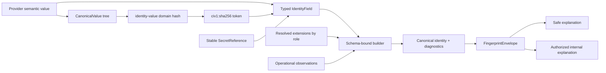

# Runtime v2 canonical v1 contract: component flow

Status: approved for issues #130 and #131 on 2026-09-27 after the issue
clarifications.

## Scope and compatibility boundary

The completed contract is a new semantic revision identified by
`sqlrs.runtime.v2.canonical.v1`. Typed fields intentionally change canonical
bytes. Values emitted by module `v0.2.0` retain discriminator
`sqlrs.runtime.v2` and are immutable **legacy-v2** values.

Legacy and canonical-v1 values coexist through separate Go types and decoders:

- a legacy decoder accepts only `sqlrs.runtime.v2` and preserves the existing
  domains, bytes, fingerprints, StateIDs, and JSON;
- a canonical-v1 decoder accepts only `sqlrs.runtime.v2.canonical.v1` and the new
  typed shapes;
- neither decoder upgrades, rehashes, or guesses the other revision;
- side-by-side persistence selects a decoder from the explicit discriminator;
- migration means resolving source declarations again under an explicitly
  selected canonical-v1 schema, never rewriting a legacy value in place.

There is no CLI, HTTP API, database-schema, resolver-provider, execution,
snapshot-policy, or default-cutover change in this feature.

## Canonical value and identity flow



## Normative primitives and five domains

All integers are unsigned big-endian. `u16`, `u32`, and `u64` occupy 2, 4, and
8 bytes. `encodeBytes(x)` is `u64(len(x)) || x`; `encodeString(s)` applies that
frame to unmodified UTF-8 bytes. Unicode normalization is never implicit.

A tagged record is:

```text
encodeString(domain) || u32(field-count) ||
repeated(u16(tag) || encodeBytes(payload))
```

Fields are unique and ordered by numeric tag. SHA-256 digests are lowercase
`sha256:<64-hex>`. Canonical-v1 owns exactly these public hash domains:

| Identity kind | Canonical domain |
| --- | --- |
| structured identity value | `sqlrs.runtime.v2/identity-value` |
| factory identity and root state | `sqlrs.runtime.v2.canonical.v1/factory-state` |
| transform identity | `sqlrs.runtime.v2.canonical.v1/transform` |
| resolved extension identity | `sqlrs.runtime.v2.canonical.v1/resolved-extension` |
| derived state | `sqlrs.runtime.v2.canonical.v1/state` |

Legacy-v2 domains keep their old meaning and are never aliases for these
canonical-v1 domains.

Factory and transform records use tags 1 through 5 for canonical semantic
schema, provider namespace, semantic kind, provider identity schema, and typed
field set. Resolved-extension records use the same tags with owner namespace in
tag 2. The typed field-set payload is `u32(count)` followed by entries ordered by
UTF-8 name bytes:

```text
encodeString(name) || u16(kind-tag) || raw-32-byte-field-commitment
```

A factory/root StateID is the factory record digest. A derived-state record uses
tag 1 for the raw 32-byte parent canonical StateID and tag 2 for the raw 32-byte
verified transform fingerprint. Legacy StateIDs or untyped fingerprints are
rejected before encoding.

## Structured canonical values

A canonical value is a type-tagged tree. Each node is
`u16(type-tag) || encodeBytes(payload)`:

- null=0, with an empty payload;
- string=1, with raw UTF-8 payload;
- list=2, with `u32(count)` and framed member nodes in caller order;
- map=3, with `u32(count)` and framed string-key node/value-node pairs;
- set=4, with `u32(count)` and framed member nodes.

Map constructors accept an entry slice, not a Go map, so duplicate source keys
are observable. Entries sort by the complete encoded string-key node. Sets sort
by complete encoded member nodes. Duplicate canonical map keys or set members
are rejected.

The canonical-value digest preimage is:

```text
encodeString("sqlrs.runtime.v2/identity-value") || encodeBytes(root-node)
```

Its external token is `civ1:sha256:<lowercase-hex>`. It is a digest reference,
not Base64 and not a reversible serialization. A token may be parsed for
comparison and display, but supported identity builders accept only a complete
`CanonicalValue` tree. Every integrity envelope containing a canonical-value
field carries that tree and recomputes the token; token-only identity subjects
are rejected rather than reported as fully verified.

The exported budgets are:

- `MaxCanonicalValueDepth = 32`;
- `MaxCanonicalValueNodes = 4096`;
- `MaxCanonicalCollectionMembers = 256`;
- `MaxCanonicalStringBytes = 4096`;
- `MaxCanonicalMapKeyBytes = 1024`;
- `MaxCanonicalValueBytes = 1 << 20`;
- `MaxCanonicalEnvelopeBytes = 4 << 20`.

The root node has depth 1 and each child adds 1. The collection-member limit is
per list, map, or set; the total-node and total-canonical-byte limits bound the
whole tree. A map entry counts as one collection member, while its key node and
value subtree count toward total nodes. Key bytes are also string bytes but use
the stricter key limit.

Constructors and decoders charge node, byte, depth, and member budgets before
recursive allocation or sorting. They reject overflow, unknown tags,
non-canonical order, duplicates, malformed tokens, and trailing bytes. Fuzz and
adversarial vectors exercise every budget.

## Typed resolved fields and field commitments

Canonical-v1 replaces mutable `{Name, Value string}` fields with opaque
`IdentityField` values. Each has a validated name, explicit kind, and read-only
accessors. Kinds and payloads are:

| Kind | Tag | Payload |
| --- | ---: | --- |
| `text` | 1 | UTF-8 bytes |
| `canonical-value` | 2 | raw 32-byte digest parsed from a `civ1` token |
| `secret-reference` | 3 | `encodeString(provider) || encodeString(identifier) || encodeString(version)` |

Text beginning with `civ1:` remains text. Only the canonical-value constructor
parses that token. A field contribution is committed as
`SHA-256(encodeString(name) || u16(kind-tag) || encodeBytes(payload))`. The
canonical identity field set is ordered by UTF-8 name bytes and encodes count,
name, kind tag, and raw 32-byte contribution commitment. Thus the kind tag
participates in the identity preimage, while safe explanations can retain an
integrity-preserving commitment when a protected payload is redacted.

## Secret boundary

Raw credentials, tokens, private keys, connection strings, and other secret
material are rejected by the supported schema-bound builders and never enter
identity values, provenance, vectors, logs, or explanations. No API hashes a raw
secret as a substitute for storage.

An identity-bearing credential revision uses only `SecretReference` containing:

1. provider namespace validated as an identifier;
2. non-empty opaque stable identifier;
3. non-empty immutable version/rotation identifier.

Identifier and version obey the exported string and aggregate budgets. Changing
the version changes the field commitment and identity. If a provider cannot
supply such a non-secret stable version reference, the credential is
execution-only metadata and is not accepted by an identity builder.

## Schema-authoring and supported builders

Low-level generic construction lives in the explicitly named public
`schemaauthor` package. It is a trust boundary: an external schema author can
misclassify a value, but repository production code may not call it directly.
A maintenance architecture check permits imports only from approved schema
packages and conformance fixtures.

An approved schema declares field name, allowed field kind, requiredness,
semantic versus operational role, and `public` versus `protected` disclosure.
It exposes a schema-bound factory/transform/extension builder. Builders accept
`IdentityField`, `CanonicalValue`, `SecretReference`, role-specific extension
results, and `OperationalObservation` through separate typed channels; there is
no conversion from an observation into an identity field.

Factory and transform builders compare declarations with resolved extensions.
Inputs are positional and count-preserving; owner and semantic kind must match;
execution environment and deployment are present exactly when declared; extra,
missing, or reordered results fail. Canonical bindings are
`extension.input.<index>`, `extension.execution_environment`, and
`extension.deployment`.

The current `ExtensionFingerprint` and `ComposeResolvedFields` remain frozen and
documented as legacy-v2 APIs. Canonical-v1 exposes separately typed
`CanonicalExtensionFingerprint` and `ComposeCanonicalResolvedFields`; the two
revisions cannot be passed to each other.

## Integrity envelopes and disclosure profiles

The persisted/transport representation is a strict `FingerprintEnvelope`, not a
bare digest. Its descriptor identifies envelope version, semantic schema,
identity kind, canonical domain, algorithm, digest, provider/owner namespace,
semantic kind, and provider identity schema where applicable. Its typed subject
contains enough non-secret canonical input to recompute all field commitments
and the fingerprint.

Allowed identity kinds are `canonical-value`, `factory-state`, `transform`,
`resolved-extension`, and `derived-state`, with a fixed one-to-one domain mapping.
Descriptors have no standalone trust-producing decoder: public decoding occurs
through the enclosing subject-bearing envelope and yields a verified read-only
descriptor. This prevents callers from treating syntactically valid metadata as
an integrity-checked fingerprint.

Strict decoders reject unknown members and invalid kind/domain/schema/algorithm
combinations, recompute canonical-value tokens, field commitments, identity and
state digests, parent links, ordered steps, and endpoints, and return structured
errors from the stable taxonomy below.

JSON is strict but not byte-canonical: insignificant whitespace and object
member order are accepted, while duplicate or unknown members, invalid UTF-8,
trailing values, and invalid shapes are rejected. Canonical ordering applies to
the framed binary values and emitted bundle files, not arbitrary input JSON.
Validation phases are ordered: document byte budget and JSON syntax; member
shape and discriminator; scalar/canonical-value limits; descriptor mapping;
payload-to-commitment links; identity digest; lineage links and endpoint. Test
fixtures normally contain one fault; multi-fault tests assert only this phase
precedence. Public errors expose stable code and path, never rejected values.

Stable error codes are `document_too_large`, `syntax_invalid`,
`unknown_member`, `duplicate_member`, `revision_mismatch`, `shape_invalid`,
`value_invalid`, `limit_exceeded`, `non_canonical`, `descriptor_invalid`,
`commitment_mismatch`, `digest_mismatch`,
`lineage_mismatch`, `endpoint_mismatch`, and `authorization_denied`. Paths use
dot-separated public member names and zero-based `[index]` segments, for example
`steps[1].state.id`; a document-wide error has an empty path. Codes classify the
failed invariant, while the phase order resolves inputs with multiple faults.

Bundle parsing additionally uses `path_invalid`, `file_missing`,
`file_unlisted`, `size_mismatch`, `file_digest_mismatch`,
`manifest_digest_mismatch`, `bundle_metadata_mismatch`, `vector_invalid`, and
`relation_mismatch`, with paths rooted at `manifest`, `files[...]`, or a
`vectors[...].cases[...]`/`relations[...]` selector. Dynamic file and case IDs
use JSON-quoted brackets to avoid ambiguity, for example
`files["vectors/limits.json"]` and `cases["limits/depth-over"]`.

Explanations are derived from an already verified envelope:

- `safe` is the default. Protected payloads and opaque secret identifiers are
  replaced by typed redaction markers. Their per-field commitments are also
  omitted because low-entropy identifiers could be guessed offline. The
  already-verified aggregate descriptor digest, StateIDs, and links remain;
- `internal` requires an explicit caller-supplied authorization decision and may
  disclose protected **non-secret** payloads and complete secret references;
- neither profile can contain raw secret material.

An explanation is a one-way projection produced only from an already verified
envelope. It has no public trust-producing decoder and cannot be used as an
identity, envelope, or proof of a redacted payload. Full envelopes alone verify
payload-to-commitment links and recompute identity and lineage. Internal
authorization is evaluated before any explanation value is constructed; nil,
denial, error, or canceled context returns no projection.

The aggregate fingerprint/StateID is intentionally public and may still allow
guessing an entire low-entropy identity. Safe explain removes the additional
per-field guessing oracle; it does not claim to make a public content-derived ID
confidential. Providers must use opaque high-entropy non-secret identifiers when
guessability itself is sensitive.

## Conformance and release flow

The conformance artifact is a versioned directory with a strict manifest,
detached digest, and vector files. Its schema and digest preimage are specified
in `runtime-v2-conformance-bundle-schema.md`. Go tests, an independent Node
verifier, fresh-process tests, and an external public-proxy consumer validate the
same embedded files.

The additive Go API plus new semantic revision is released as module `v0.3.0`.
Checked-in release notes contain the static schema, compatibility, migration,
and bundle information but never attempt to contain their own commit SHA. After
merge, the exact completion SHA on `main` is preflighted; `v0.3.0-rc.1` and then
`v0.3.0` point to that same SHA. Release automation generates a content-addressed
release attestation from the tagged commit containing source SHA, module/tag,
canonical schema, bundle-schema version, bundle version, and detached manifest
digest, then publishes it as a non-overwriting release asset. Verification binds
the asset back to the protected tag and proxy; asset storage alone is not a trust
root.

The gates are sequential: pre-merge tests and bundle policy; RC tag/proxy and
clean-consumer verification; GA tag/proxy/checksum and attestation verification;
post-release issue closure. A later gate cannot be represented as a passing PR
unit test. PR #135 closed implementation issues #130/#131; publication evidence
and post-GA closure were completed by issue #133.
