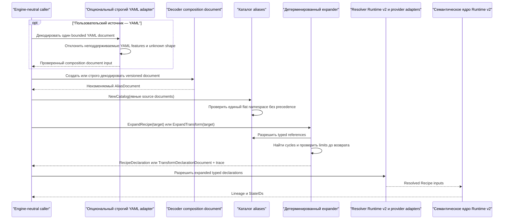
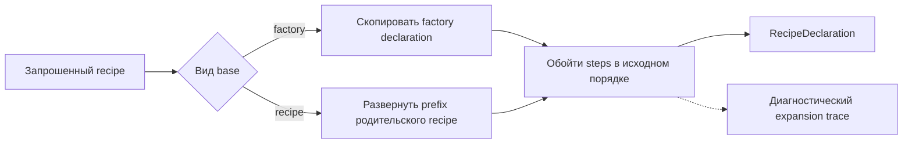

# Композиция aliases Runtime v2: поток взаимодействия

Статус: согласовано @evilguest для issue #109 после критического анализа
дизайна, 2026-09-27.

Композиция aliases Runtime v2 преобразует пользовательские aliases transforms и
recipes в существующие engine-neutral declaration types `runtimev2`. Expansion
выполняется до resolver dispatch, fingerprinting, execution и persistence. Этот
слой не разрешает mutable inputs и не создаёт логические States.

Дизайн не добавляет production CLI syntax, HTTP API, схему БД и не меняет
default runtime. Текущие команды с `*.prep.s9s.yaml` и `*.run.s9s.yaml` остаются
на legacy path. Новая схема остаётся opt-in контрактом до отдельно согласованной
интеграции с продуктовой точкой входа.

## Поток от документа к declaration

Core package принимает strict JSON и constructor inputs. Будущий CLI-side YAML
adapter отображает ту же логическую схему в эти constructors и не создаёт вторую
семантическую модель. Adapter принимает один документ и отклоняет duplicate
keys, anchors, aliases, merge keys, custom tags, несколько YAML documents,
directives, unknown fields, non-string scalar coercion и input больше
документированных byte/node/depth limits.

## Построение каталога

Caller передаёт явный набор source documents. Composition package не сканирует
директории, не выводит imports и не выбирает precedence источников. Все aliases
входят в единый плоский case-sensitive namespace:

- имя должно быть lower-case identifier в стиле Runtime;
- reference разрешается по точному имени;
- каждый source document имеет уникальный bounded logical `SourceID`;
- отсутствие совпадений возвращает `missing_reference`;
- несколько definitions из разных источников возвращают
  `ambiguous_reference`;
- результат catalog construction и expansion не зависит от порядка обхода
  sources.

CLI adapter использует workspace-relative source IDs со slash separators вместо
absolute host paths. Callers не должны помещать secrets в source IDs, поскольку
они видны в errors и traces. Source identifiers и structural JSON pointers
сохраняются только для диагностики. Они никогда не попадают в expanded
declaration и не становятся implicit base для declaration field.

## Expansion рецепта

Recipe содержит ровно одну форму base и ordered step list:

- `base.factory` содержит `runtimev2.FactoryDeclaration`;
- `base.recipe` ссылается на другой recipe и использует его полностью expanded
  последовательность factory-plus-transforms как prefix;
- `steps[].use` ссылается на standalone transform alias;
- `steps[].transform` содержит `runtimev2.TransformDeclaration`.

`base.factory` и `base.recipe` взаимно исключаются. Reference из `base.recipe`
должен разрешаться в recipe, а `steps[].use` — в transform. Несовпадение типа
возвращает `wrong_reference_kind`; recipe нельзя использовать как обычный step.

Expansion использует итеративный алгоритм с состояниями посещения. Recipe,
который уже находится в активной цепочке, возвращает `cycle` с полной closed
cycle chain. Validation, reference resolution, cycle detection и expanded-size
checks завершаются до возврата результата; при ошибке partial declaration не
возвращается.

Failures следуют traversal order: target validation, полная base chain, затем
transforms от deepest recipe к target и в source step order. Каждый текущий
reference разрешается до его projected count/size checks. Traversal
останавливается на первой failure; поздние unvisited defects её не заменяют.

Recipe без transforms допустим. Порядок steps копируется буквально, никогда не
сортируется и не распараллеливается. Поскольку у recipe не больше одного recipe
prefix, а recipe aliases запрещены в steps, nesting не создаёт экспоненциальный
fan-out. Итоговое число transforms ограничено `runtimev2.MaxTransforms`.

## Expansion standalone transform

`ExpandTransform` возвращает versioned `TransformDeclarationDocument` и не
требует принадлежности canonical recipe. Caller может разрешить его и применить
полученный transform относительно любого существующего State через действующий
контракт relative lineage Runtime v2.

## Семантический output и diagnostic trace

Expanded declaration и trace являются отдельными значениями:

- declaration содержит только скопированные factory и ordered transforms;
- trace использует schema `sqlrs.runtime.v2.alias-expansion-trace.v1` и связывает
  factory и каждую позицию output transform с compact diagnostic origin records;
- alias names, source identifiers и source paths никогда не копируются в
  declaration references, arguments, attributes или extension fields;
- переименование aliases при равном expanded declaration поэтому не меняет
  downstream resolved identity при равных provider/resolver semantics и
  external inputs;
- изменение validated значения child declaration меняет parent expanded
  declaration, но StateID гарантированно меняется только при изменении resolved
  identity-bearing input.

Равная expanded semantic form определяется структурным равенством validated
`RecipeDeclaration`, а не байтами исходного YAML или равенством traces.

Trace хранит dense node table с parent-node IDs вместо повторения полной alias
chain для каждого transform. Factory/transform origin records ссылаются на эти
nodes и используют RFC 6901 JSON Pointers для definition и reference sites.
Nodes выделяются сначала для target, затем вниз по recipe-base chain, затем для
named transforms в output order; повторные uses остаются отдельными
occurrences. Поэтому размер trace растёт линейно от числа visited aliases и
output transforms. Recipe и trace проверяются по размеру и возвращаются
атомарно.

## Path и provider binding

Composition package рассматривает factory/transform declarations как opaque
validated values. Он не интерпретирует и не rebases `reference`, arguments,
attributes или extension fields. Каждый provider contract владеет base и
normalization rules своих полей. В частности, declaration
`sqlrs.workspace/file` из #108 остаётся workspace-root-relative.

`SourceID` и filesystem location composition document никогда не становятся
implicit path base. Provider-aware authoring adapter материализует пути по
правилам provider contract до создания document. Legacy compatibility adapter
сначала применяет текущее alias-file-relative binding и документированный
default precedence, затем создаёт explicit Runtime v2 declaration. Перемещение
или переименование только alias source не может неявно rebase-ить semantic input.

## Defaults и параметры

Схема `sqlrs.runtime.v2.aliases.v1` не содержит parameters, overrides, imports и
implicit inheritance. Все значения композиции явные. Если compatibility adapter
использует legacy default, он сначала применяет существующий документированный
precedence и материализует выбранный declaration input до вызова composition
layer. Core expander не читает workspace или global config.

## Legacy compatibility

Legacy alias translation находится вне generic package, поскольку текущие
`kind`/`image`/`args` требуют CLI path binding и provider-specific declaration
semantics. Для закрытия issue #109 после публикации public composition module
требуется independently mergeable CLI compatibility slice. Этот adapter
сначала принимает только legacy prepare aliases и переводит их только когда
способен построить полные и детерминированные Runtime v2 factory и transform
declarations. Legacy run preset получает classification
`legacy_semantics_unsupported` и не считается identity-bearing transform.
Другие неподдержанные inputs возвращают structured `legacy_only` со стабильной
причиной и actionable remedy, например `runtime_v2_provider_unavailable`.

Classification не отключает существующую legacy command. Композицию Runtime v2
нельзя смешивать с legacy executor или использовать для переосмысления legacy
state/cache records.

## Граница ошибок

Стабильные классы ошибок composition: `invalid_document`, `missing_reference`,
`ambiguous_reference`, `wrong_reference_kind`, `cycle` и
`expansion_too_large`. Ошибки предоставляют `Code`, optional `SourceID`, RFC
6901 `Pointer` и bounded deterministic cycle/candidate context, но не содержимое
declarations. Failures из package constructors, dedicated decoders, catalog и
expansion operations соответствуют package sentinel `ErrInvalid`. Duplicate
source IDs возвращают `invalid_document`. Resolution, acquisition, execution,
persistence и смысл provider fields находятся вне этого слоя.
