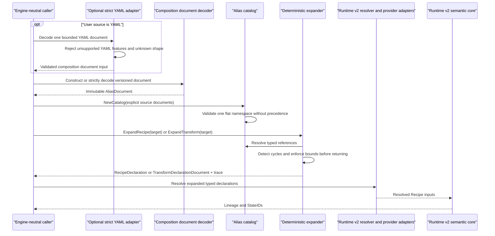
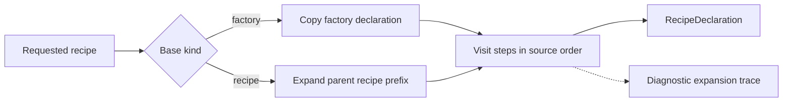

# Runtime v2 alias composition: interaction flow

Status: approved by @evilguest for issue #109 after critical design review,
2026-09-27.

Runtime v2 alias composition turns user-authored transform and recipe aliases
into the existing engine-neutral `runtimev2` declaration types. Expansion
happens before resolver dispatch, fingerprinting, execution, and persistence.
It neither resolves mutable inputs nor creates logical States.

This design adds no production CLI syntax, HTTP API, database schema, or
default-runtime change. The current `*.prep.s9s.yaml` and `*.run.s9s.yaml`
commands remain on the legacy path. The new schema is an opt-in contract until
a separately approved integration switches or extends a product entry point.

## Document-to-declaration flow

The core package accepts strict JSON and constructor inputs. A future CLI-side
YAML adapter maps the same logical schema into those constructors; it does not
introduce a second semantic model. The adapter accepts one document, rejects
duplicate keys, anchors, aliases, merge keys, custom tags, multiple YAML
documents, directives, unknown fields, non-string scalar coercion, and input
beyond the documented byte/node/depth limits.

## Catalog construction

A caller supplies an explicit set of source documents. The composition package
does not scan directories, infer imports, or choose a source-precedence order.
Every alias enters one flat, case-sensitive namespace:

- a name must be a lower-case Runtime-style identifier;
- a reference is resolved by exact name;
- every source document has a unique, bounded logical `SourceID`;
- no match is `missing_reference`;
- more than one definition from different sources is `ambiguous_reference`;
- catalog construction and expansion are independent of source iteration order.

The CLI adapter uses workspace-relative slash-separated source IDs rather than
absolute host paths. Callers must not place secrets in source IDs because they
are exposed in errors and traces. Source identifiers and structural JSON
pointers are retained only for diagnostics. They never enter an expanded
declaration or implicitly rebase a declaration field.

## Recipe expansion

A recipe has exactly one base form and an ordered step list:

- `base.factory` embeds one `runtimev2.FactoryDeclaration`;
- `base.recipe` references another recipe and uses that recipe's complete
  expanded factory-plus-transform sequence as the prefix;
- `steps[].use` references one standalone transform alias;
- `steps[].transform` embeds one `runtimev2.TransformDeclaration`.

`base.factory` and `base.recipe` are mutually exclusive. A `base.recipe`
reference must resolve to a recipe, while `steps[].use` must resolve to a
transform. A mismatched type is `wrong_reference_kind`; a recipe cannot be used
as an ordinary step.

Expansion uses an iterative visit-state algorithm. A recipe already in the
active chain yields `cycle` with the complete closed cycle chain. Validation,
reference resolution, cycle detection, and expanded-size checks complete before
any value is returned; errors never expose a partial declaration.

Failures follow traversal order: validate the target, walk its complete base
chain, then visit transforms from the deepest recipe back to the target and in
source step order. Each current reference is resolved before its projected
count/size checks. Traversal stops at the first failure; later unvisited defects
do not replace it.

A recipe with no transforms is valid. Step order is copied literally and is
never sorted or parallelized. Because a recipe has at most one recipe prefix
and recipe aliases are forbidden in steps, nesting cannot create exponential
fan-out. The final transform count remains bounded by `runtimev2.MaxTransforms`.

## Standalone transform expansion

`ExpandTransform` returns a versioned `TransformDeclarationDocument` without
requiring canonical recipe membership. A caller may resolve it and apply the
resulting transform relative to any existing State through the existing
Runtime v2 relative-lineage contract.

## Semantic output and diagnostic trace

The expanded declaration and trace are separate values:

- the declaration contains only the copied factory and ordered transforms;
- the trace uses schema `sqlrs.runtime.v2.alias-expansion-trace.v1` and maps the
  factory and each output transform position to compact diagnostic origin
  records;
- alias names, source identifiers, and source paths are never copied into
  declaration references, arguments, attributes, or extension fields;
- renaming aliases while retaining equal expanded declarations therefore
  leaves downstream resolved identity unchanged when provider/resolver semantics
  and external inputs are otherwise equal;
- changing a child's validated declaration value changes the parent expanded
  declaration, while only a change to resolved identity-bearing input is
  guaranteed to change a StateID.

Structural equality of validated `RecipeDeclaration` values, not source YAML
bytes or trace equality, defines equal expanded semantic form.

The trace stores a dense node table with parent-node IDs instead of repeating a
complete alias chain for every transform. Factory and transform origin records
refer to those nodes and use RFC 6901 JSON Pointers for definition and reference
sites. Nodes are allocated target-first, then down the recipe-base chain, then
for named transforms in output order; repeated uses remain separate
occurrences. This keeps trace growth linear in visited aliases plus output
transforms. Recipe and trace results are size-checked together and returned
atomically.

## Path and provider binding

The composition package treats factory and transform declarations as opaque
validated values. It does not interpret or rebase `reference`, argument,
attribute, or extension fields. Each provider contract owns the base and
normalization rules for its fields. In particular, the #108
`sqlrs.workspace/file` declaration remains workspace-root-relative.

A composition document's `SourceID` and filesystem location never become an
implicit path base. A provider-aware authoring adapter must materialize paths
according to its provider contract before document construction. The legacy
compatibility adapter first applies the current alias-file-relative binding and
documented default precedence, then constructs an explicit Runtime v2
declaration. Moving or renaming only an alias source cannot silently rebase a
semantic input.

## Defaults and parameters

Schema `sqlrs.runtime.v2.aliases.v1` has no parameters, overrides, imports, or
implicit inheritance. Every composition value is explicit. If a compatibility
adapter consumes a legacy default, it must first apply the existing documented
precedence and materialize the selected declaration input before calling the
composition layer. The core expander never reads workspace or global config.

## Legacy compatibility

Legacy alias translation is outside the generic package because current
`kind`/`image`/`args` values require CLI path binding and provider-specific
declaration semantics. Closing issue #109 requires an independently mergeable
CLI compatibility slice after the public composition module is released. That
adapter initially accepts only legacy prepare aliases and translates them only
when it can construct a complete, deterministic Runtime v2 factory and transform
declaration. A legacy run preset is classified as
`legacy_semantics_unsupported`; it is not treated as an identity-bearing
transform. Other unsupported inputs return a structured `legacy_only` result
with a stable reason and an actionable remedy, for example
`runtime_v2_provider_unavailable`.

Classification never disables the existing legacy command. Runtime v2
composition must not be combined with the legacy executor or reinterpret
legacy state/cache records.

## Failure boundary

Stable composition error classes are `invalid_document`, `missing_reference`,
`ambiguous_reference`, `wrong_reference_kind`, `cycle`, and
`expansion_too_large`. Errors expose `Code`, optional `SourceID`, an RFC 6901
`Pointer`, and bounded deterministic cycle/candidate context, but not declaration
contents. Failures from package constructors, dedicated decoders, catalog, and
expansion operations match the package `ErrInvalid` sentinel. Duplicate source
IDs are `invalid_document`. Resolution, acquisition, execution, persistence, and
provider field meaning remain outside this layer.
