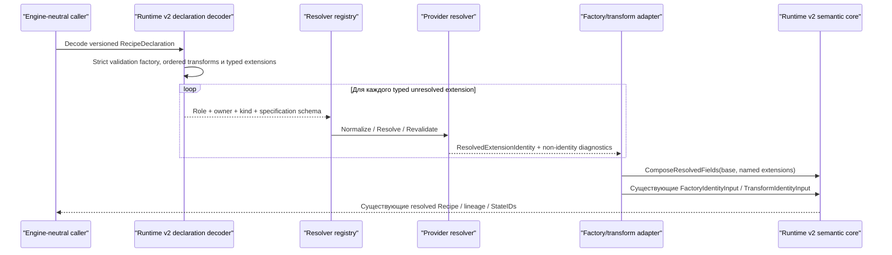

# Versioned declarations Runtime v2: поток взаимодействия

Статус: согласовано @evilguest для issues #108, #123 и #124, 2026-09-24.

Issue #124 завершает unresolved boundary Runtime v2 без изменения identity,
fingerprint, StateID и lineage algorithms из #107. Issue #108 использует эту
границу вместо создания конкурирующей declaration/resource-identity модели.

CLI, HTTP API, схема БД и default runtime в этом slice не меняются.

## Поток declaration-to-resolution

`RecipeDeclaration` и resolved `Recipe` — разные Go/JSON types. Factory-only
declaration содержит пустой transform list. Порядок transforms сохраняется.
Declaration spelling, extension specifications, aliases, capability/portability
observations и resolver diagnostics не входят в существующие fingerprint
algorithms Runtime v2.

Typed extension roles различаются типами:

- `InputDeclaration` для file, Git, package и других data inputs;
- `ExecutionEnvironmentDeclaration` для OCI/runtime environments;
- `DeploymentDeclaration` для provider-owned database/deployment specs.

Они используют общий versioned provider envelope, но один role нельзя передать
вместо другого. Resolver dispatch использует role, owner, kind и specification
schema, а не unqualified kind.

## Standalone и nested transport

Существующие #107 provenance fixtures содержат diagnostic `FactoryDeclaration`
и `TransformDeclaration` внутри уже versioned semantic containers. Для
сохранения golden vectors их nested wire shape не меняется.

Новый standalone transport использует обязательные wrappers:

- `FactoryDeclarationDocument`;
- `TransformDeclarationDocument`;
- `RecipeDeclaration`.

Каждый wrapper содержит `schema_version: sqlrs.runtime.v2` и strict decoding.
Missing/unknown versions, unknown/duplicate envelope members, invalid UTF-8 и
превышение существующих limits возвращают `ValidationError`.

Typed extension specification использует canonical name/value fields,
квалифицированные `owner`, `kind`, `specification_schema`. Для core содержимое
opaque, но это не unversioned ad hoc map. Core проверяет envelope, bounds, unique
field names и ordering; provider проверяет смысл fields.

## Resolution boundary

Resolver возвращает `ResolvedExtensionIdentity`, а не factory/transform. Он
содержит `schema_version`, `owner`, `kind`, `identity_schema` и canonical resolved
fields. Adapter явно включает один или несколько resolved extensions в
существующую resolved factory/transform identity. File content identity нельзя
ошибочно принять за полный execution transform.

Composition не является free-form: каждый named extension fingerprinted с
domain `sqlrs.runtime.v2/resolved-extension`, затем `ComposeResolvedFields`
добавляет один reserved field `extension.<name>` для каждого supplied binding.
Helper запрещает collisions/omissions внутри input. Adapter conformance tests
сравнивают declaration extensions с supplied bindings, поэтому resolved input не
может быть молча потерян до построения State identity.

Capabilities, portability results и resolver observations используют отдельные
diagnostic types/envelopes. Их можно сохранять для explainability, но они не
входят в canonical identity bytes.
