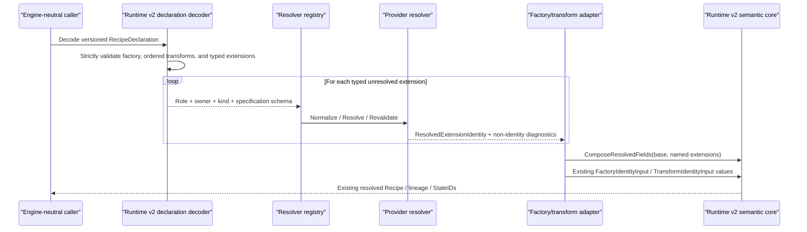

# Runtime v2 versioned declarations: interaction flow

Status: approved by @evilguest for issues #108, #123, and #124, 2026-09-24.

Issue #124 completes the unresolved side of the Runtime v2 contract without
changing the identity, fingerprint, StateID, or lineage algorithms from #107.
Issue #108 consumes this boundary instead of defining a competing declaration or
resource-identity model.

There are no CLI, HTTP API, database-schema, or default-runtime changes in this
slice.

## Declaration-to-resolution flow

`RecipeDeclaration` and resolved `Recipe` are different Go and JSON types. A
factory-only declaration has an empty transform list. Transform order is
preserved. Declaration spelling, extension specifications, aliases,
capability/portability observations, and resolver diagnostics never enter the
existing Runtime v2 fingerprint algorithms.

Typed extension roles are separate by construction:

- `InputDeclaration` for file, Git, package, and other data inputs;
- `ExecutionEnvironmentDeclaration` for OCI/runtime environments;
- `DeploymentDeclaration` for provider-owned database/deployment specifications.

All share a versioned provider envelope, but one role cannot be passed where
another is required. Resolvers dispatch on role, owner, kind, and specification
schema rather than an unqualified kind string.

## Standalone and nested transport

Existing #107 provenance fixtures embed diagnostic `FactoryDeclaration` and
`TransformDeclaration` values inside already-versioned semantic containers. To
preserve those golden vectors, their nested wire shape remains unchanged.

New standalone transport uses required wrappers:

- `FactoryDeclarationDocument`;
- `TransformDeclarationDocument`;
- `RecipeDeclaration`.

Each wrapper carries `schema_version: sqlrs.runtime.v2` and strict decoding.
Missing/unknown versions, unknown or duplicate envelope members, invalid UTF-8,
and values beyond existing Runtime v2 limits fail with `ValidationError`.

Typed extension specifications use canonical name/value fields qualified by
`owner`, `kind`, and `specification_schema`. This is opaque to the core but is
not an unversioned ad hoc map. The core validates envelope shape, bounds, unique
field names, and ordering; the selected provider validates field meaning.

## Resolution boundary

Resolvers return `ResolvedExtensionIdentity`, not a factory or transform. It has
`schema_version`, `owner`, `kind`, `identity_schema`, and canonical resolved
fields. A consuming adapter explicitly composes one or more resolved extensions
into the existing resolved factory/transform identity. This prevents a file
content identity from being mistaken for a complete execution transform.

Composition is not free-form: every named extension is fingerprinted with the
domain `sqlrs.runtime.v2/resolved-extension`, then
`ComposeResolvedFields` adds one reserved `extension.<name>` field per supplied
binding. The helper rejects collisions and omissions within its input. Adapter
conformance tests compare declaration extensions with supplied bindings so an
adapter cannot silently drop a resolved input before State identity construction.

Capabilities, portability results, and resolver observations use separate
diagnostic types/envelopes. They may be persisted for explainability but are
excluded from canonical identity bytes.
