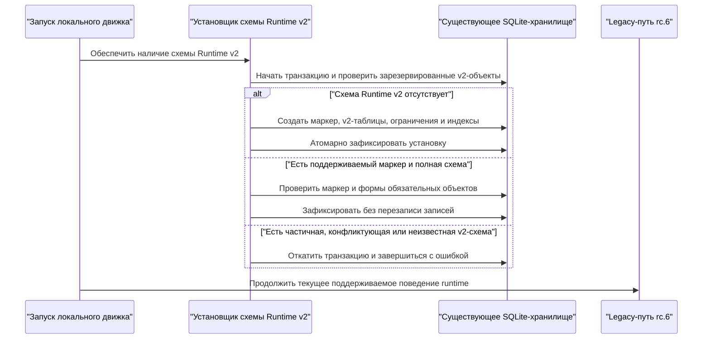
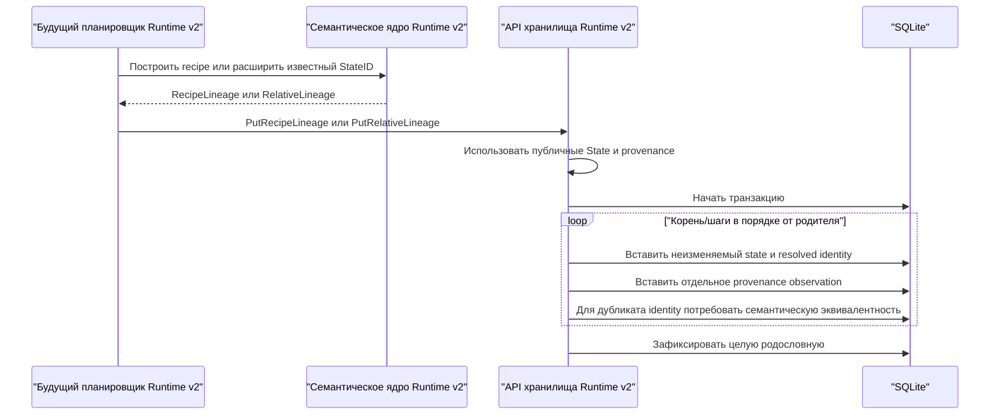
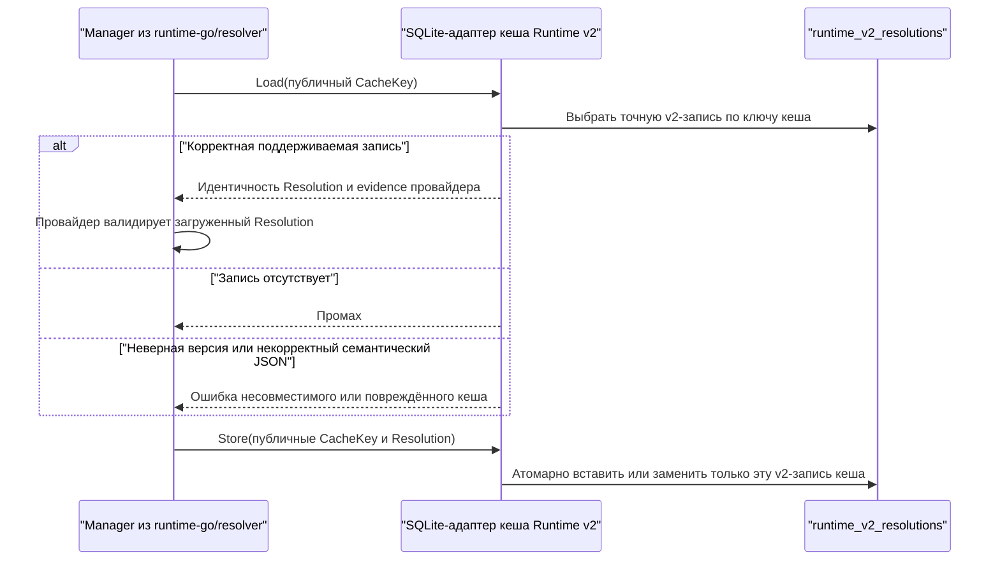
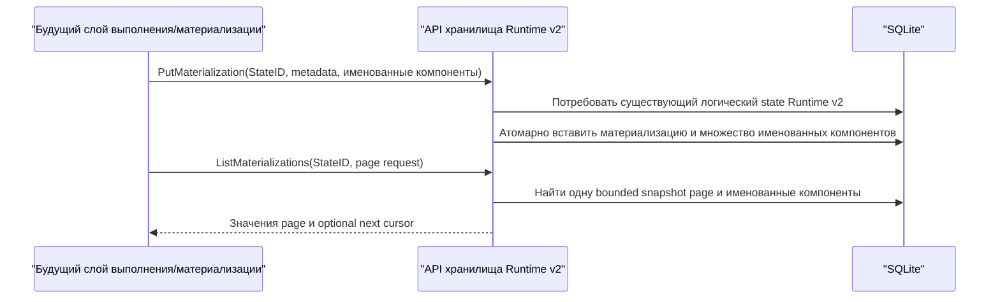

# Персистентность Runtime v2: поток взаимодействий

Статус: согласовано пользователем для issue #110, 2026-09-27.

Примечание о версии: порядок обращения к хранилищу результатов ниже
описывает первоначальный договор задачи #110. В версии 0.5.0 та же таблица
SQLite использует канонический результат и новый формат записи из
[порядка канонического разрешения](runtime-v2-canonical-resolver-flow.RU.md).
Хранение логических состояний и физических результатов не меняется.

Персистентность Runtime v2 является внутренней возможностью локального движка.
Она не добавляет CLI или HTTP API и не переводит поддерживаемый путь
prepare/runtime с legacy-семантики rc.6. Новое хранилище принимает публичные
неизменяемые значения из `backend/libs/runtime-go` и раздельно хранит логическую
идентичность, данные кеша resolver и физические материализации.

## Установка схемы и перезапуск

Установщик никогда не переписывает, не копирует и не переклассифицирует legacy-
таблицы. Заполненное rc.6-хранилище является допустимым входом обновления. Старые
бинарные файлы могут игнорировать зарезервированные v2-таблицы, поэтому отключение
пока неактивного пути Runtime v2 не требует обратной миграции данных. Установка
идемпотентна; неизвестный маркер или частичная зарезервированная схема приводят к
ошибке, а не к попытке угадать способ восстановления.

## Сохранение логической родословной

Адаптер не вычисляет StateID или fingerprint трансформации. Он сериализует
семантические типы, а при чтении применяет их валидируемые декодеры и операции
выведения, чтобы проверить согласованность индексируемых столбцов, resolved
identity и родительских ссылок. Relative lineage можно сохранить только если её
anchor уже является известным state Runtime v2. Корневое или производное
логическое состояние может существовать без материализации, но случайно создать
осиротевшую производную запись нельзя.

Identity-bearing factory или transform identity хранится один раз вместе с
логическим State. Необязательные spelling declaration и resolver observations
хранятся как insert-only дедуплицированное множество provenance observations.
Два observations с одинаковым resolved identity и разными diagnostics допустимы
и не конкурируют за StateID. Для повторной identity-записи сохранённое публичное
значение декодируется и снова кодируется, после чего сравниваются канонические
байты. Другая resolved identity под тем же StateID считается повреждением и не
перезаписывается. Observations дедуплицируются storage-only digest канонического
публичного JSON; совпавший digest дополнительно требует равенства байтов.

## Кеш разрешений

Адаптер реализует публичный контракт resolver `Cache`. В resolver-модуль
добавляется непрозрачное публичное значение `CacheRecord`, сохраняющее digest
ключа, workspace scope, descriptor resolver, normalized declaration, resolution
и checksum. `NewCacheRecord`, строгий JSON decoder, `Matches(CacheKey)` и
`Resolution()` позволяют persistence-адаптеру проверять запись, не раскрывая
изменяемые внутренности `CacheKey` и не повторяя его digest.

Точный поиск обращается только к `runtime_v2_resolutions`; legacy-строки
state/cache не могут дать совпадение. Для hit должны совпасть индексированный и
вложенный ключи, workspace scope, descriptor и normalized declaration из
публичного `CacheKey`. Общий декодер проверяет версионированный конверт, checksum
и resolved extension identity. Evidence провайдера проверяет выбранный resolver
в соответствии с существующим контрактом Runtime v2.

## Связь с материализацией

ID материализации, backend/locator, имена компонентов, runtime/job ID, временные
метки и размеры являются несемантическими метаданными. Они не передаются в
выведение identity Runtime v2. Компоненты образуют множество по имени и для
хранения и сравнения канонически сортируются по имени; порядок caller не имеет
смысла. Материализация может содержать несколько отдельно именованных
компонентов; схема не приравнивает логическое состояние к одному пути файловой
системы. Множество связей читается только через bounded snapshot-page contract.

## Запросы и ошибки

Хранилище поддерживает точный поиск State, bounded cursor-based чтение
provenance, ограниченный обход lineage, точный поиск кеша resolution, bounded
cursor-based страницы materialization и явную классификацию state-записи.
Provenance и materialization page содержит не более 100 записей и 32 MiB
canonical returned data. Materializations используют стабильный
newest-persisted-first порядок `insertion_seq DESC` без раскрытия storage
sequence;
opaque cursor версионирован, связан со своим StateID и содержит insertion
high-water mark первой страницы, исключающий later inserts из traversal. Runtime
v2 getters читают только v2-таблицы. Provenance использует эквивалентный insertion
snapshot в first-observed-first порядке `insertion_seq ASC`.
Диагностический классификатор принимает raw ID string и независимо сообщает
наличие legacy, наличие v2 и сохранённую версию v2-записи, включая защитный
результат `both`, не преобразуя записи.

Все пути чтения завершаются ошибкой при неподдерживаемой версии записи,
некорректном JSON, нарушении семантической целостности, отсутствии обязательного
родителя, цикле или превышении публичного лимита трансформаций семантического
ядра либо 32-MiB lineage result budget. Отмена и ошибки хранилища возвращаются
без частичных семантических значений.

Writes, отменённые или завершившиеся ошибкой до commit, откатываются. При
неоднозначном результате commit после reopen видна только полная старая или
полная новая generation, а повтор идемпотентной операции сходится к новой.
Persisted timestamps используют fixed-width UTC nanoseconds. Page order задаётся
storage-only insertion sequence и не зависит от caller clocks.
