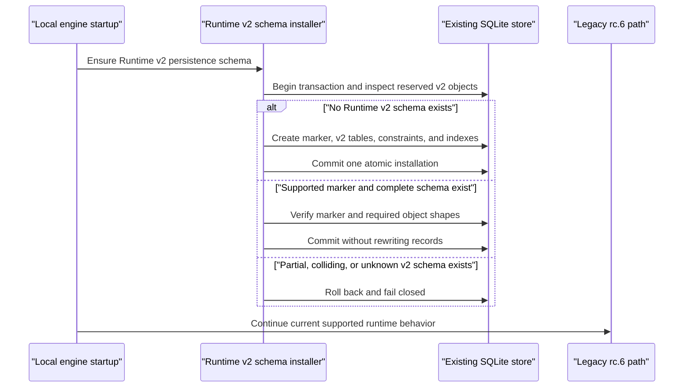
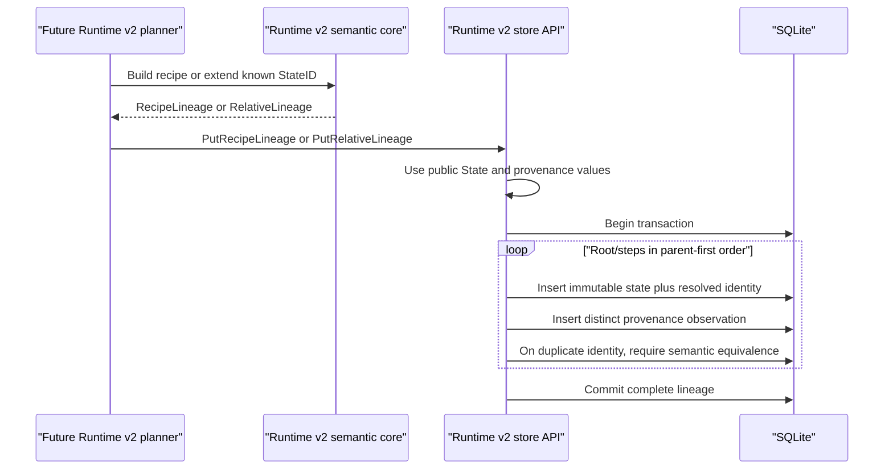
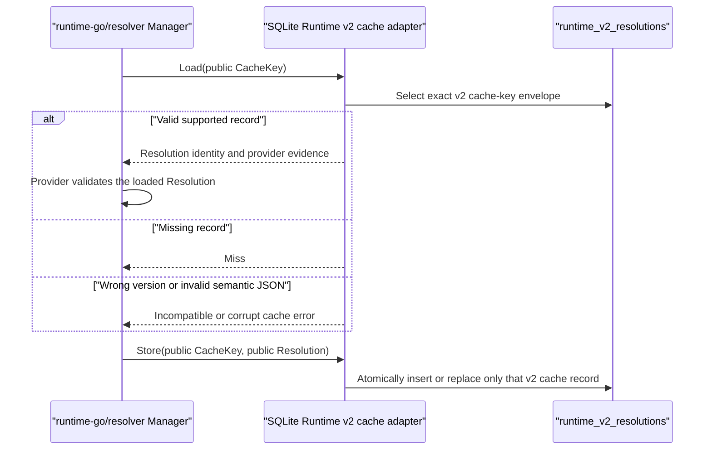
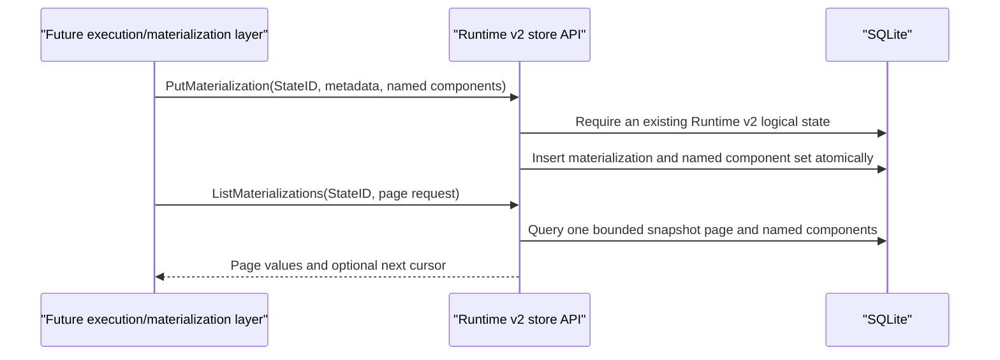

# Runtime v2 persistence: interaction flow

Status: approved by the user for issue #110, 2026-09-27.

Runtime v2 persistence is an internal local-engine capability. It adds no CLI or
HTTP API and does not switch the supported prepare/runtime path from the legacy
rc.6 semantics. The new store consumes the public immutable values from
`backend/libs/runtime-go` and keeps logical identity, resolver cache data, and
physical materializations in separate versioned records.

## Schema installation and restart

The installer never rewrites, copies, or reclassifies legacy tables. A populated
rc.6 store is a valid upgrade input. Older binaries may ignore the reserved v2
tables, so disabling the dormant Runtime v2 path does not require a reverse data
migration. Installation is idempotent and an unsupported marker or partial
reserved schema is an error rather than an invitation to guess a repair.

## Persisting logical lineage

The adapter does not calculate a StateID or transform fingerprint. It asks the
semantic types to serialize and, on reads, uses their validated decoders and
derivation operations to verify that indexed columns, resolved identity, and
parent links agree. A relative lineage may be stored only when its anchor is
already a known Runtime v2 state. A root or derived logical state can therefore
exist without a materialization, while an orphan derived record cannot be
introduced accidentally.

The identity-bearing factory or transform identity is stored once with the
logical State. Optional declaration spelling and resolver observations are
stored as an insert-only, deduplicated set of provenance observations. Two
observations with equal resolved identity but different diagnostics are valid
and do not compete for the StateID. An idempotent repeated identity write
decodes and re-encodes the stored public value, then compares canonical bytes.
A different resolved identity under the same StateID is corruption and is never
overwritten. Provenance observations are deduplicated by a storage-only digest
of their canonical public JSON; a digest collision must also pass byte equality.

## Resolution cache

The adapter implements the public resolver `Cache` contract. The resolver module
adds an opaque public `CacheRecord` value that retains the key digest, workspace
scope, resolver descriptor, normalized declaration, resolution, and checksum.
`NewCacheRecord`, strict JSON decoding, `Matches(CacheKey)`, and `Resolution()`
let persistence adapters validate a record without exposing mutable `CacheKey`
internals or reimplementing its digest.

The exact lookup touches only `runtime_v2_resolutions`; legacy state/cache rows
cannot satisfy the query. A hit requires the indexed key, embedded key, workspace
scope, descriptor, and normalized declaration to match the caller's public
`CacheKey`. Generic decoding validates the versioned envelope, checksum, and
resolved extension identity. Provider-owned evidence is validated by the
selected resolver, as in the existing Runtime v2 resolver contract.

## Materialization association

Materialization IDs, backend/locator data, component names, runtime or job IDs,
timestamps, and sizes are non-semantic metadata. None is passed to Runtime v2
identity derivation. Components form a name-keyed set and are canonically sorted
by name for persistence and comparison; caller order has no meaning. A
materialization may contain multiple independently named components, and no
schema rule equates one logical state with one filesystem path. Multiple
associations are read only through the bounded snapshot-page contract.

## Queries and failure behavior

The store supports exact State lookup, bounded cursor-based provenance lookup,
bounded lineage traversal, exact resolution-cache lookup, bounded cursor-based
materialization pages, and explicit state-record classification. Provenance and
materialization pages contain at most 100 records and 32 MiB of canonical
returned data. Materializations use stable newest-persisted-first
`insertion_seq DESC` order without exposing the storage sequence;
the opaque cursor is versioned, bound to its StateID, and carries a first-page
insertion high-water mark that excludes later inserts from the traversal.
Provenance uses the equivalent insertion snapshot in first-observed-first
`insertion_seq ASC` order. Runtime v2 getters query only v2 tables. The
diagnostic classifier accepts a raw ID string and reports legacy presence, v2
presence, and the stored v2 record version independently, including a defensive
`both` result, without converting either record.

All read paths fail closed on unsupported record versions, malformed JSON,
semantic integrity mismatches, missing required parents, cycles, or lineage over
the public semantic-core transform limit or 32-MiB lineage result budget.
Cancellation and storage failures are returned without partial semantic values.

Writes canceled or failed before commit roll back. If a commit result is
ambiguous, reopening may reveal only the complete old or complete new
generation, and retrying the idempotent operation converges to the new one.
Persisted timestamps use fixed-width UTC nanoseconds. Page order comes from the
storage-only insertion sequence and is independent of caller clocks.
