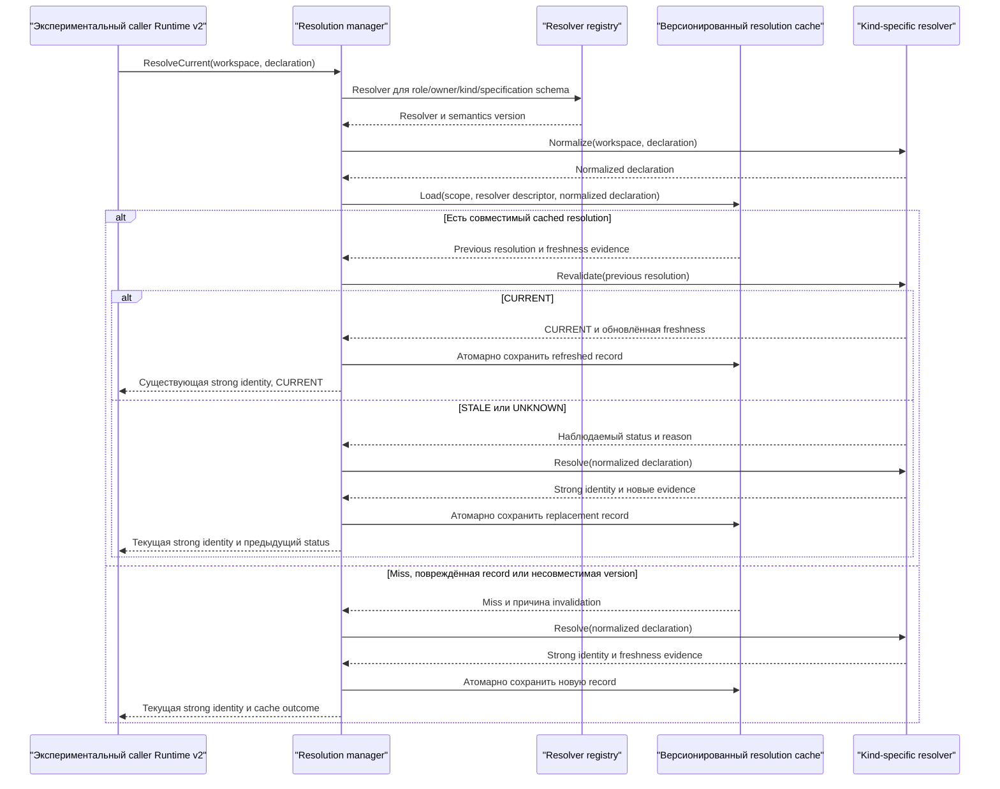
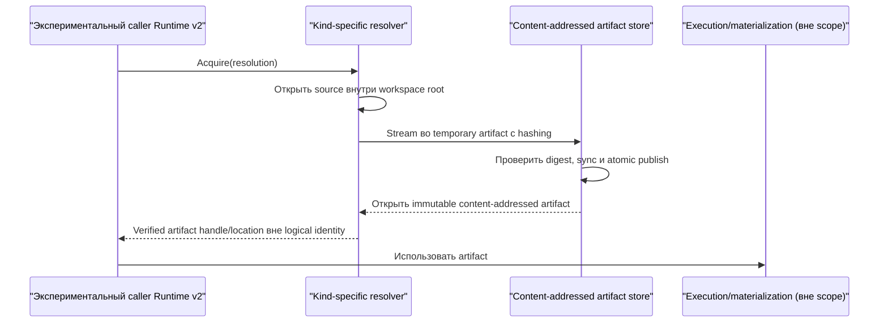

# Resolver Runtime v2: поток взаимодействия

Статус: согласовано @evilguest для issue #108, 2026-09-24.

Resolver layer преобразует изменяемые декларации ресурсов в стабильные для
повторного воспроизведения content identity. Это engine-neutral библиотека рядом
с semantic core Runtime v2. Resolution, revalidation, acquisition и execution
остаются раздельными; issue не подключает resolver к default prepare/runtime.

Изменений CLI, HTTP API и схемы БД нет. Persistent resolution cache — новое
versioned directory storage, которое не читает и не меняет legacy cache records.

## Разрешение с кешем

`ResolveCurrent` не вызывает `Acquire`: при уже известном логическом `StateID`
caller может остановиться после дешёвого `CURRENT`. `STALE` и `UNKNOWN` различимы
в outcome, хотя convenience flow после обоих выполняет resolution заново.
`Revalidate` также доступен напрямую.

- `CURRENT`: provider evidence доказывают непрерывность cached bytes.
- `STALE`: evidence доказывают, что старый resolution не описывает текущую
  declaration, включая удаление, non-regular replacement или изменение size.
- `UNKNOWN`: непрерывность не доказана: filesystem identity недоступна, weak
  metadata изменилась, файл заменён или observation временно не удалось.

`UNKNOWN` никогда молча не становится `CURRENT`. Повторный resolution может дать
ту же identity, например после изменения только metadata.

## Acquisition

Acquisition выполняется явно и возвращает physical artifact отдельно от
identity. Ошибка acquisition не изменяет identity. Package не запускает Docker,
Liquibase или DBMS.

File resolver никогда не возвращает handle mutable workspace file. Он stream-ит
source в trusted content-addressed artifact store, вычисляет hash exact stream и
публикует temporary artifact только при совпадении digest с resolution. Existing
artifact проверяется перед использованием. При mismatch возвращается stale
error; mutation workspace после acquisition не меняет artifact.

## Workspace-file resolver

Reference resolver принимает `InputDeclaration` с owner `sqlrs.workspace`, kind
`file`, specification schema `sqlrs.workspace-file.declaration.v1` и ровно одним
field `path`. Все другие fields отклоняются, чтобы inputs не игнорировались
молча. Он:

1. один раз канонизирует workspace root в абсолютную physical directory;
2. требует непустой relative reference, очищает её, отклоняет absolute/volume
   paths и `..` escapes и сохраняет `/` separators;
3. открывает path внутри Go 1.25 `os.Root`, не допускающего traversal за пределы
   root даже при concurrent изменениях; pre/post checks отклоняют symlinks,
   Windows reparse points и non-regular leaf;
4. снимает before/after handle metadata и вычисляет SHA-256 по
   открытому потоку; concurrent change повторяется один раз, затем возвращается
   `changed_during_resolution`;
5. возвращает schema `sqlrs.workspace-file.v1`, field
   `content.digest=sha256:<lowercase hex>` и отдельные freshness evidence.

Symlink самого workspace root разрешается при создании resolver. Links/reparse
points ниже physical root запрещены, а `os.Root` остаётся security boundary при
concurrent rename/link races. Cheap revalidation даёт `CURRENT`
только при совпадении strong continuity evidence. Для включённых Unix revisions
это device/inode, change time, size и mtime; на Windows — volume/file identity,
per-file USN, size и last-write time. Evidence снимается до и после stable content
read, чтобы digest не сочетался с change token другой generation. Неполные
evidence дают `UNKNOWN` и новый hash. Поэтому замена с
сохранением weak size/timestamp metadata не переиспользует stale identity.

Evidence strength определяется per-filesystem, а не только per-OS. Включённые
classes: `ntfs-usn` revision `ntfs-usn-v1` на NTFS Windows, APFS на macOS и
ext4/XFS/Btrfs на Linux. Windows объединяет volume/file identity, per-file USN и
last-write metadata; Unix объединяет device/inode/ctime с size и mtime. Каждый
native test перезаписывает bytes того же размера, восстанавливает mtime и
доказывает, что результат не `CURRENT`. OverlayFS, network, virtual, unknown,
coarse-timestamp и непроверенные
filesystems всегда дают `UNKNOWN`. Classification, evidence revision и downgrade
reason наблюдаемы и меняются вместе с resolver semantics.
Checked-in capability table связывает каждый enabled class с evidence revision;
CI отклоняет enabled entry без mandatory native job. Unlisted classes disabled.

Resolver отклоняет обнаруженный mount/filesystem transition ниже workspace root.
`os.Root` не допускает symlink traversal за root; regular-file и pre/post checks
реализуют более строгий no-link policy. Same-device bind mount manipulation,
который host не позволяет определить portably, находится вне attacker model и
требует контроля trusted workspace mount namespace.

На Windows отклоняются volume-qualified paths, alternate-data-stream syntax,
reserved device names и ambiguous trailing-dot/space components. Case сохраняется
для diagnostics; разные spellings на case-insensitive filesystem могут создать
разные cache entries, но дают одинаковую content identity. Hash loops проверяют
context cancellation между bounded chunks.

Удаление, directory или special-file replacement дают `STALE`; изменение size —
`STALE`. Несовпадение file identity или timestamp/change token даёт `UNKNOWN`,
так как bytes могут совпадать; rehash сохраняет identity только при равных bytes.

## Persistence и invalidation

Strict JSON cache envelope содержит schema `sqlrs.resolution-cache.v1`, digest
канонического physical workspace root, normalized key, resolver kind и semantic
version, resolved extension identity, provenance, freshness и bounded provider evidence.
Absolute workspace path не сохраняется. Имя файла — SHA-256 от schema, scope
digest, role/owner/kind/specification schema, resolver semantic version и
normalized declaration.

Key preimage использует domain-separated tagged length-prefixed binary grammar
для schema version, role, owner, kind, specification schema и normalized
canonical field set. Он не зависит от JSON или Go map order. Semantic version в key позволяет
старым и новым resolver process сосуществовать без перезаписи records; старые
версии остаются inert до cache GC.

Directory cache валиден только в engine-owned trusted directory, но не в mutable
workspace. Constructors создают restrictive permissions и отклоняют directory,
которая является link/reparse point или доступна для записи untrusted principals,
когда platform позволяет это надёжно определить. Каждая record содержит SHA-256
checksum normative envelope без самого checksum member для accidental corruption.
Checksum не аутентифицирует
данные против владельца cache directory; shared/multi-tenant authorization — #110.

Запись использует same-directory temporary file, file sync и platform-specific
atomic replacement. Replacement — visibility commit point: после него полная
новая запись может быть видима, даже если следующий parent-directory sync дал
ошибку. Тогда возвращается durability error; retry/load принимает полную
committed entry, а restart durability заявляется только после успешного platform
durability step. Recovery игнорирует orphaned temporary files. Reader ограничивает
size и строго валидирует данные. Corrupt,
unknown-schema, mismatched-key и incompatible semantic-version records fail
closed как наблюдаемые invalidations и не трактуются как legacy records. При
смене semantics меняется resolver semantic version. Ошибка записи cache
возвращается caller, а не выдаётся за restart-safe результат.

Cache miss, corrupt record и incompatible version — наблюдаемые fallback cases и
могут привести к fresh resolve. Permission, cancellation и общий I/O error
прерывают операцию, не маскируются под miss и не перезаписываются. Для `CURRENT`
обновлённый freshness сохраняется до success; ошибка store возвращается caller-у.

Cache предоставляет bounded pruning по schema/semantic-version namespace,
maximum age и entry count. Pruning игнорирует active temporary files и не следует
links. Ошибка fallback resolution возвращает structured error с предыдущим
`STALE`/`UNKNOWN` status и reason, сохраняя observability без partial replacement.
