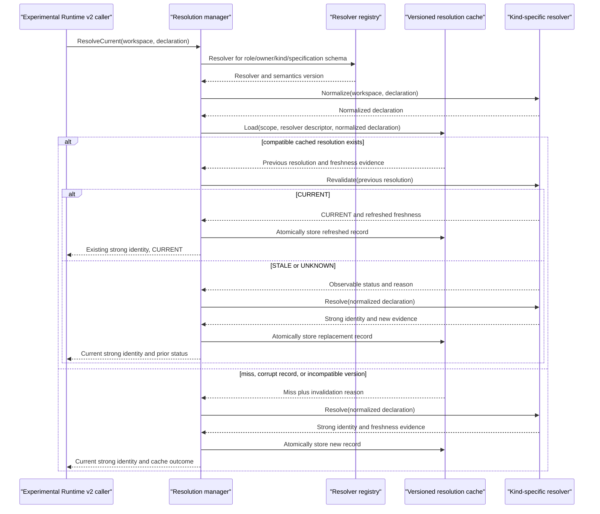
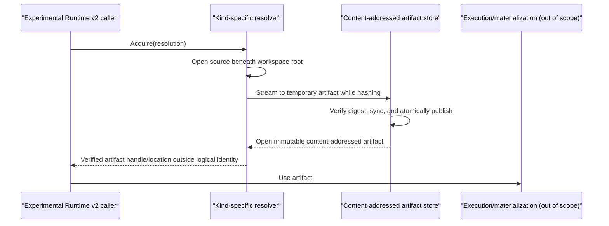

# Runtime v2 resolver: interaction flow

Status: approved by @evilguest for issue #108, 2026-09-24.

The resolver layer converts mutable resource declarations into replay-stable
content identities. It is an engine-neutral library beside the Runtime v2
semantic core. Resolution, revalidation, acquisition, and execution remain
separate operations; this issue does not connect the resolver to the default
prepare/runtime path.

There are no CLI, HTTP API, or database-schema changes in this issue. The
persistent resolution cache is a new, versioned directory store and never reads
or rewrites legacy state/cache records.

## Cached resolution

`ResolveCurrent` never calls `Acquire`. A caller that already has the resulting
logical `StateID` can stop after a cheap `CURRENT` result. `STALE` and `UNKNOWN`
remain distinguishable in the outcome even though both cause the convenience
flow to resolve again. Direct callers may invoke `Revalidate` independently.

- `CURRENT`: provider evidence proves continuity with the cached bytes.
- `STALE`: evidence proves the old resolution cannot describe the current
  declaration, including deletion, a non-regular replacement, or a size change.
- `UNKNOWN`: continuity cannot be proved, including unsupported filesystem
  identity, changed weak metadata, replacement, or transient observation error.

`UNKNOWN` is never silently converted to `CURRENT`. Re-resolution can produce
the same content identity, for example after a metadata-only change.

## Acquisition

Acquisition is explicit and returns physical artifact information separately
from resolved identity. Acquisition failure does not mutate identity. The
generic package does not start Docker, Liquibase, or a DBMS.

The file resolver never returns a handle to the mutable workspace file. It
streams the source into a trusted content-addressed artifact store, hashes that
exact stream, and publishes the temporary artifact only when its digest matches
the requested resolution. Existing artifacts are revalidated before use. A
mismatch reports a stale resolution. Workspace mutation after acquisition cannot
alter the returned artifact.

## Workspace-file resolver

The reference resolver accepts an `InputDeclaration` with owner
`sqlrs.workspace`, kind `file`, specification schema
`sqlrs.workspace-file.declaration.v1`, and exactly one field named `path`. It
rejects every other field so no declaration input is silently ignored. It:

1. canonicalizes the configured workspace root once to an absolute physical
   directory;
2. requires a non-empty relative reference, lexically cleans it, rejects
   absolute/volume-qualified paths and `..` escapes, and stores `/` separators;
3. opens beneath a Go 1.25 `os.Root`, which prevents traversal outside the root
   even if path components change concurrently; pre/post checks reject symbolic
   links, Windows reparse points, and a non-regular leaf;
4. captures before/after handle metadata and hashes the opened
   bytes with SHA-256; a concurrent change is retried once and then returns
   `changed_during_resolution`;
5. returns identity schema `sqlrs.workspace-file.v1` with field
   `content.digest=sha256:<lowercase hex>` and separate freshness evidence.

The workspace-root symlink, if any, is resolved during construction. Links or
reparse points beneath that physical root are rejected, while `os.Root` provides
the security boundary under concurrent rename/link races. Cheap
revalidation returns `CURRENT` only when strong continuity evidence matches. On
Unix that is device/inode plus change time, size, and modification time. On
Windows it is volume/file identity plus change time, size, and last-write time.
Unsupported or incomplete evidence yields `UNKNOWN` and a new hash. Thus a
replacement preserving weak size/timestamp metadata cannot reuse stale identity.

Evidence strength is classified per filesystem, not merely per operating
system. Candidate strong classes are NTFS on Windows, APFS on macOS, and
ext4/XFS/Btrfs on Linux. A class is enabled for the cheap path only after its
native live integration gate proves the required replacement and change-token
behavior; until then it returns `UNKNOWN`. OverlayFS requires the same explicit
evidence. Network, virtual, unknown, coarse-timestamp, or otherwise unverified
filesystems always return `UNKNOWN`. The classification, evidence revision, and
downgrade reason are observable diagnostics and change with resolver semantics.
A checked-in capability table binds each enabled class to an evidence revision;
CI rejects an enabled entry without its mandatory native job. Unlisted classes
are disabled by default.

The resolver rejects a detected mount/filesystem transition below the workspace
root. `os.Root` prevents symlink traversal outside the root; regular-file and
pre/post component checks enforce the stricter no-link policy. Same-device bind
mount manipulation that the host cannot expose portably is outside the library's
attacker model and requires control of the trusted workspace mount namespace.

On Windows, declarations reject volume-qualified paths, alternate-data-stream
syntax, reserved device names, and ambiguous trailing-dot/space components.
Case is preserved diagnostically; duplicate spellings on a case-insensitive
filesystem may create separate cache entries but resolve to the same content
identity. Hash loops check context cancellation between bounded chunks.

Deletion and replacement by a directory or special file are `STALE`; a size
change is `STALE`. File-identity or timestamp/change-token mismatch is `UNKNOWN`,
because bytes might still match; rehashing retains the identity exactly when the
contents are unchanged.

## Persistence and invalidation

Each strict JSON cache envelope contains cache schema
`sqlrs.resolution-cache.v1`, a digest of the canonical physical workspace root,
normalized key, resolver kind and semantic version, resolved extension identity,
provenance, freshness, and bounded provider evidence. The absolute workspace
path is not persisted. Its file name is a SHA-256 digest of cache schema,
workspace-scope digest, role/owner/kind/specification schema, resolver semantic
version, and normalized declaration.

The key preimage uses a domain-separated, tagged, length-prefixed binary grammar
over schema version, role, owner, kind, specification schema, and the normalized
canonical field set. It does not depend on JSON object order or Go map order.
Including semantic version lets old and new resolver processes coexist without
overwriting one another's entries; old versions remain inert until cache GC.

The directory cache is valid only in an engine-owned trusted directory, never in
the mutable workspace. Constructors create restrictive permissions and reject a
directory that is a symlink/reparse point or is writable by untrusted principals
where the platform can determine that safely. Every record includes a SHA-256
checksum over its normative envelope excluding the checksum member itself, to
detect accidental corruption. A checksum
is integrity detection, not authentication against an attacker who controls the
cache directory; shared/multi-tenant authorization belongs to #110.

Writes use a same-directory temporary file, file sync, and platform-specific
atomic replacement. Replacement is the visibility commit point: after it, a
complete new entry may be observed even if the following parent-directory sync
fails. Such a failure returns a durability error; retry/load accepts the complete
committed entry, while restart durability is claimed only after the platform
durability step succeeds. Recovery ignores orphaned temporary files. Readers are
size-bounded and strict. Corrupt, unknown-schema,
mismatched-key, and resolver-semantic-version records fail closed as observable
invalidations and are never interpreted as legacy records. A semantics change
requires a new resolver semantic version. Cache write failure is returned rather
than claiming a restart-safe result that was not persisted.

Cache miss, corrupt records, and incompatible versions are observable fallback
conditions and may proceed to fresh resolution. Permission, cancellation, and
general I/O failures abort the operation and are never treated as a miss or
overwritten. A `CURRENT` result persists refreshed freshness before success; if
that store fails, the manager returns the cache error and no restart-safe success.

The cache exposes bounded pruning by schema/semantic-version namespace, maximum
age, and maximum entry count. Pruning ignores active temporary files and never
follows links. A failed fallback resolution returns a structured error carrying
the prior `STALE` or `UNKNOWN` status and reason, so observability is retained
without returning a partial replacement resolution.
