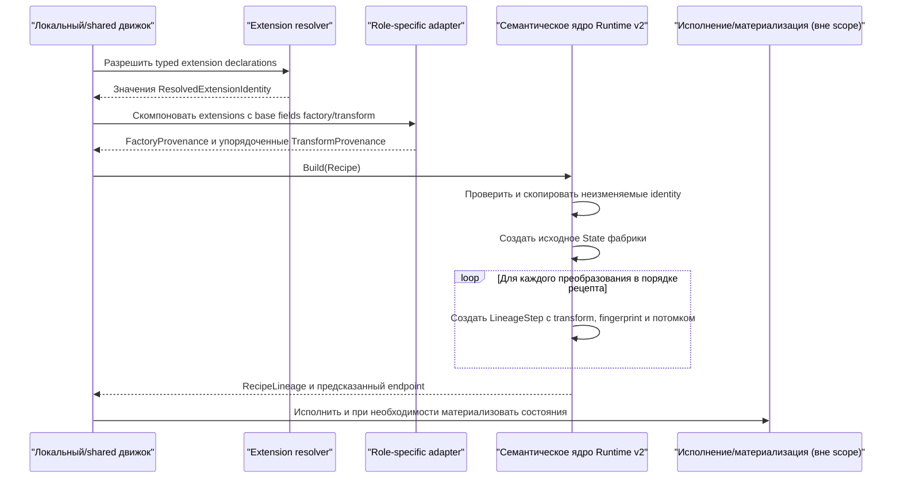
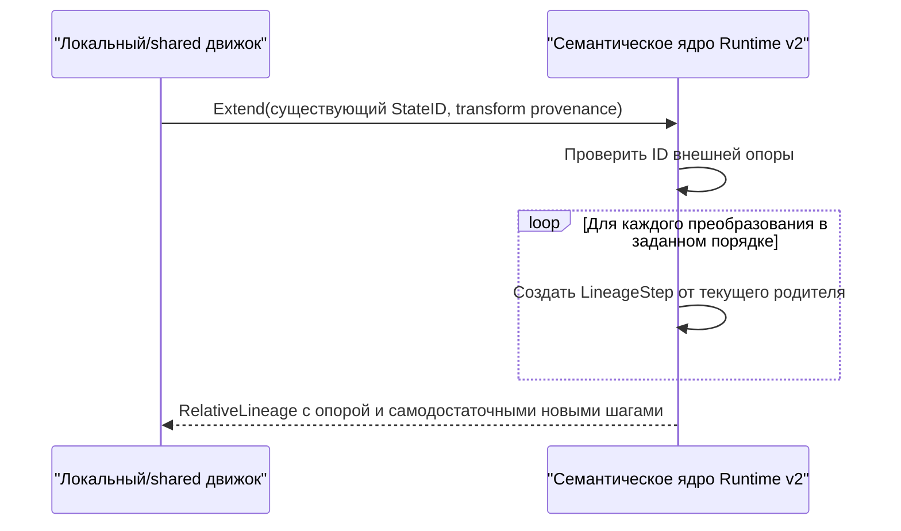

# Семантическое ядро Runtime v2: поток взаимодействия

Статус: согласовано @evilguest для issue #107, 2026-09-23. Исправления по
критическому анализу согласованы в той же беседе до проектирования тестов.
Уточнение границы #108/#124 согласовано 2026-09-24.

Runtime v2 отделяет логическую идентичность состояния от разрешения входов,
исполнения и физической материализации. Семантическое ядро — чистый, независимый
от движка Go-модуль. Оно получает уже разрешённые неизменяемые идентичности и
заранее строит самодостаточный lineage без запуска СУБД, анализа содержимого БД
и чтения метаданных снимков.

## Lineage рецепта



Рецепт без преобразований возвращает исходное состояние фабрики и пустой список
шагов. Служебное или синтетическое преобразование не создаётся. Порядок влияет на
идентичность, потому что каждый дочерний ID включает ID предыдущего состояния.
Каждый `LineageStep` сохраняет resolved identity преобразования, достаточную для
пересчёта fingerprint и состояния после сериализации.

## Относительный lineage



`RecipeLineage` и `RelativeLineage` — разные типы Go и JSON, а не варианты,
выбранные изменяемой строкой. Recipe lineage владеет provenance фабрики и корнем;
relative lineage — внешней опорой и только новыми шагами. Они различны по
конструкции даже при одинаковом endpoint. Сам endpoint StateID намеренно совпадает,
когда совпадают родитель и упорядоченные resolved transforms: тип контейнера
истории не изменяет формулу состояния Runtime v2.

## Resolved identity и диагностика

Semantic core и extension boundary предоставляют явно разделённые слои:

- `ResolvedFactoryIdentity` или `ResolvedTransformIdentity` влияет на identity;
- resolver возвращает `ResolvedExtensionIdentity`, который влияет на factory-
  или transform-identity только после явной композиции adapter-ом;
- необязательные declaration и resolver observation служат диагностикой.

Версионированные declarations, композиция extensions и resolver contracts
отдельно заданы в [потоке declarations](runtime-v2-declaration-flow.RU.md) и
[потоке resolver](runtime-v2-resolver-flow.RU.md). Уточнение не меняет алгоритмы
fingerprint, StateID и lineage, принятые в #107.

Resolved identity содержит `Provider`, `Kind`, `IdentitySchema` и уникальные
именованные `ResolvedField`. `IdentitySchema` версионирует смысловой контракт
полей provider-а. Версия бинарника или сборки resolver-а диагностическая и не
меняет identity, пока смысловое изменение не выберет новую `IdentitySchema`.

Ядро гарантирует, что каждое переданное resolved field влияет на fingerprint.
Provider отвечает за передачу всех полей своей документированной identity schema.
Написание declaration может меняться без изменения прежней resolved identity.

## Каноническая кодировка

Все хеши используют SHA-256 и сериализуются как `sha256:<64 строчных hex-цифры>`.
Хеширование использует следующую нормативную бинарную грамматику, не JSON:

```text
u16          = беззнаковое 16-битное число, big-endian
u32          = беззнаковое 32-битное число, big-endian
u64          = беззнаковое 64-битное число, big-endian
bytes        = u64(длина-в-байтах) || точные байты
string       = bytes(корректный UTF-8, без Unicode-нормализации)
digest       = ровно 32 декодированных байта SHA-256
field        = u16(tag) || bytes(payload)
record       = string(domain) || u32(число-полей) || field...
field-set    = u32(число-элементов) || (string(name) || string(value))...
```

Поля record записываются один раз по возрастанию числового tag. Resolved field
set сортируется по беззнаковому побайтовому порядку ASCII-имени; повторы имён
запрещены. Transforms рецепта и lineage steps не сортируются. Отсутствующие
необязательные поля пропускаются; пустые identity values запрещены, поэтому
отсутствие и пустое значение не сливаются.

Для identity фабрики и преобразования используются tags:

| Tag | Payload | Влияет на identity |
| --- | --- | --- |
| 1 | строка версии схемы | да |
| 2 | строка provider | да |
| 3 | строка kind | да |
| 4 | строка identity-schema | да |
| 5 | закодированный field-set | да |

В derived-state record tag 1 содержит 32 байта digest родителя, tag 2 — 32 байта
fingerprint resolved transform. Текстовые префиксы `sha256:` проверяются и
удаляются перед кодированием.

Домены:

- `sqlrs.runtime.v2/factory-state` для разрешённой фабрики/корня;
- `sqlrs.runtime.v2/transform` для fingerprint разрешённого преобразования;
- `sqlrs.runtime.v2/state` для производного состояния.

```text
RootStateID = SHA256(canonical(factory-state domain, factory identity))
TransformFingerprint = SHA256(canonical(transform domain, transform identity))
StateID = SHA256(canonical(state domain, ParentStateID, TransformFingerprint))
```

У корневого состояния `FactoryFingerprint` и `StateID` содержат один digest.
Новый набор identity fields, алгоритм хеша или байтовая грамматика требуют нового
namespace схемы и новых доменов; существующие v2 values не переосмысливаются.

## Проверка и ограничения ресурсов

Имена identity (`Provider`, `Kind`, `IdentitySchema`, имена полей) — lowercase
ASCII identifiers по шаблону `[a-z][a-z0-9._-]{0,127}`. Значения resolved fields
— корректный непустой UTF-8 до 4096 байт. Identity содержит до 256 полей, recipe
или relative suffix — до 10 000 transforms. Проверяемый JSON одного semantic
value ограничен 4 MiB.

Kind declaration следует правилу identity-name. Declaration references и
arguments — valid UTF-8 строки от 1 до 4096 байт; declaration содержит до 256
arguments. Diagnostic attributes имеют lowercase ASCII identity names, UTF-8
values до 4096 байт и до 256 entries. Resolver implementation — identity-name,
его version — непустая UTF-8 строка до 128 байт.

Публичные decoder-ы и builders возвращают `ValidationError{Code, Path}` без
ошибочного значения. Стабильные коды: `invalid_version`, `invalid_shape`,
`invalid_value`, `duplicate_field`, `too_large`, `integrity_mismatch`. Частичный
state или lineage не возвращается.

Declaration и diagnostic fields сериализуются для provenance, но исключены из
канонической identity. Runtime ID, job ID, время, пути, checkpoint backend и
материализация отсутствуют в identity values и не влияют на логический StateID.

## Существующая managed database identity

Семантический модуль не импортирует локальные managed-identity types. Будущий
adapter отображает их логические неизменяемые resolved values в поля фабрики.
Для PostgreSQL кандидатами являются engine kind, image digest, initialization
digest, policy version и видимое в SQL managed username. Store/authorization
locators `DomainRef`, `LineageRef` и контрольная копия `IdentityDigest` остаются
вне логической identity Runtime v2. Adapter и его точная field schema относятся
к последующей интеграции за пределами issue #107.

## Граница ошибок

Разрешение, хранение, авторизация, поиск кэша, исполнение, выбор checkpoint и
смысловая эквивалентность БД остаются ответственностью вызывающей стороны. На
каждой границе хранения или удалённого доверия semantic value принимается только
через проверяемое декодирование.
