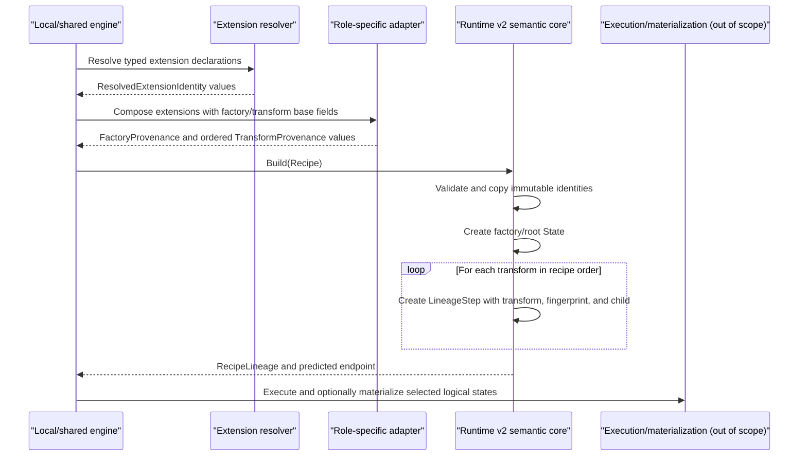
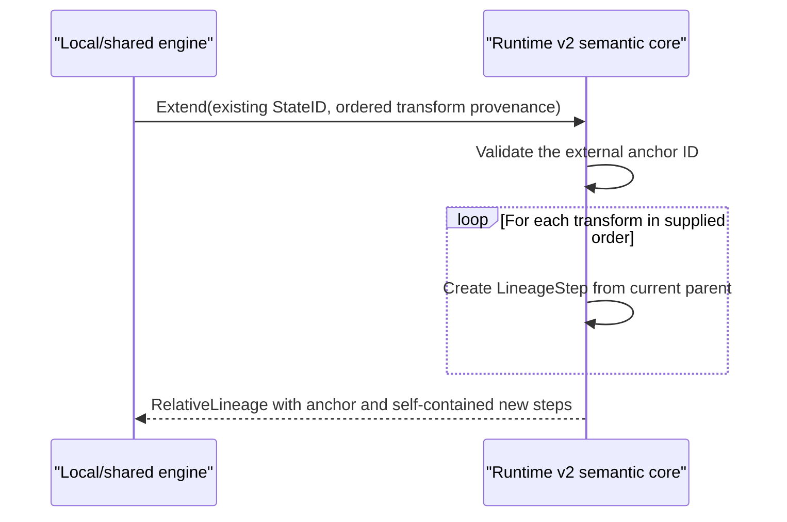

# Runtime v2 semantic core: interaction flow

Status: approved by @evilguest for issue #107, 2026-09-23. The critical-review
corrections were approved in the same conversation before test design.
The #108/#124 boundary clarification was approved 2026-09-24.

Runtime v2 separates logical state identity from resolution, execution, and
physical materialization. The semantic core is a pure, engine-neutral Go module.
It accepts already resolved immutable identities and predicts self-contained
lineage without starting a DBMS, inspecting database contents, or reading
checkpoint metadata.

## Recipe lineage



A recipe with zero transforms returns a factory/root state and no steps. No
placeholder or synthetic transform is introduced. Transform order is
identity-bearing because each derived ID includes the immediately preceding
state ID. Each `LineageStep` retains the resolved transform identity needed to
recompute its fingerprint and resulting state after serialization.

## Relative lineage



`RecipeLineage` and `RelativeLineage` are different Go and JSON types rather than
variants selected by a mutable string. Recipe lineage owns factory provenance and
a root state. Relative lineage owns an external anchor and only newly predicted
steps. They remain distinct by construction even when they have the same endpoint.
The endpoint StateID is intentionally the same when the parent and ordered
resolved transforms are the same; history-container identity does not alter the
Runtime v2 state formula.

## Resolved identity and diagnostics

The semantic core and extension boundary expose explicitly separated layers:

- `ResolvedFactoryIdentity` or `ResolvedTransformIdentity` is identity-bearing;
- a resolver returns `ResolvedExtensionIdentity`, which becomes factory or
  transform identity-bearing only through explicit adapter composition;
- optional declaration and resolver-observation metadata is diagnostic.

The versioned declaration, extension composition, and resolver contracts are
specified separately in the [declaration flow](runtime-v2-declaration-flow.md)
and [resolver flow](runtime-v2-resolver-flow.md). This clarification does not
change the #107 fingerprint, StateID, or lineage algorithms.

Each resolved identity contains `Provider`, `Kind`, `IdentitySchema`, and unique
named `ResolvedField` values. `IdentitySchema` versions the provider's semantic
field contract. A resolver binary/build version is diagnostic and does not change
identity unless its semantic change also selects a new `IdentitySchema`.

The core guarantees that every supplied resolved field affects its fingerprint.
The provider remains responsible for supplying all fields required by its
documented identity schema. Declaration spelling may change without affecting
identity when the resolved identity remains the same.

## Canonical encoding

All digests use SHA-256 and serialize as `sha256:<64 lowercase hex digits>`.
Hashing uses the following normative binary grammar, not JSON:

```text
u16          = unsigned 16-bit integer, big-endian
u32          = unsigned 32-bit integer, big-endian
u64          = unsigned 64-bit integer, big-endian
bytes        = u64(byte-length) || exact bytes
string       = bytes(valid UTF-8, no Unicode normalization)
digest       = exactly 32 decoded SHA-256 bytes
field        = u16(tag) || bytes(payload)
record       = string(domain) || u32(field-count) || field...
field-set    = u32(item-count) || (string(name) || string(value))...
```

Fields in a record are emitted once in ascending numeric-tag order. The resolved
field set is sorted by the unsigned bytewise order of its ASCII name; duplicate
names are rejected. Recipe transforms and lineage steps are never sorted. Absent
optional fields are omitted; present empty values are forbidden for all identity
fields, so absent and empty cannot collapse.

Factory and transform identity records use these tags:

| Tag | Payload | Identity-bearing |
| --- | --- | --- |
| 1 | schema version string | yes |
| 2 | provider string | yes |
| 3 | kind string | yes |
| 4 | identity-schema string | yes |
| 5 | encoded field-set | yes |

The derived-state record uses tag 1 for the 32-byte parent digest and tag 2 for
the 32-byte resolved-transform fingerprint. Textual `sha256:` prefixes are
validated and removed before this encoding.

The domains are:

- `sqlrs.runtime.v2/factory-state` for a resolved factory/root state;
- `sqlrs.runtime.v2/transform` for a resolved transform fingerprint;
- `sqlrs.runtime.v2/state` for a derived state.

Therefore:

```text
RootStateID = SHA256(canonical(factory-state domain, factory identity))
TransformFingerprint = SHA256(canonical(transform domain, transform identity))
StateID = SHA256(canonical(state domain, ParentStateID, TransformFingerprint))
```

For a root state, `FactoryFingerprint` and `StateID` contain the same digest. A
new identity field set, hash algorithm, or byte grammar requires a new schema
namespace and new domains; it must not reinterpret existing v2 values.

## Validation and resource limits

Identity names (`Provider`, `Kind`, `IdentitySchema`, field names) are lowercase
ASCII identifiers matching `[a-z][a-z0-9._-]{0,127}`. Resolved field values are
valid UTF-8, non-empty, and at most 4096 bytes. An identity contains at most 256
fields and a recipe or relative suffix contains at most 10,000 transforms.
Validated JSON for one semantic value is limited to 4 MiB.

Declaration kind uses the identity-name rule. Declaration references and
arguments are valid UTF-8 strings of 1 to 4096 bytes; a declaration has at most
256 arguments. Diagnostic attributes have lowercase ASCII identity names, values
of at most 4096 UTF-8 bytes, and at most 256 entries. Resolver implementation is
an identity-name and its version is a non-empty UTF-8 string of at most 128 bytes.

Public decoding and builders return `ValidationError{Code, Path}` without
including rejected values. Stable codes are `invalid_version`, `invalid_shape`,
`invalid_value`, `duplicate_field`, `too_large`, and `integrity_mismatch`. No
operation returns a partial state or lineage.

Declaration and diagnostic fields are serialized for provenance but excluded
from canonical identity. Runtime IDs, job IDs, timestamps, paths, checkpoint
backends, and materialization data are absent from identity values and cannot
affect a logical StateID.

## Existing managed database identity

The semantic module does not import local managed-identity types. A later engine
adapter maps their logical, immutable resolved values into factory fields. Current
PostgreSQL candidates include engine kind, image digest, initialization digest,
policy version, and the SQL-observable managed username. Store/authorization
locators such as `DomainRef` and `LineageRef`, and integrity copies such as
`IdentityDigest`, remain outside Runtime v2 logical identity. The adapter and its
exact field schema are integration work outside issue #107.

## Failure boundary

Resolution, persistence, authorization, cache lookup, execution, checkpoint
selection, and semantic database-content equivalence remain caller
responsibilities. Every persistence or remote trust boundary must use validated
decoding before accepting a semantic value.
